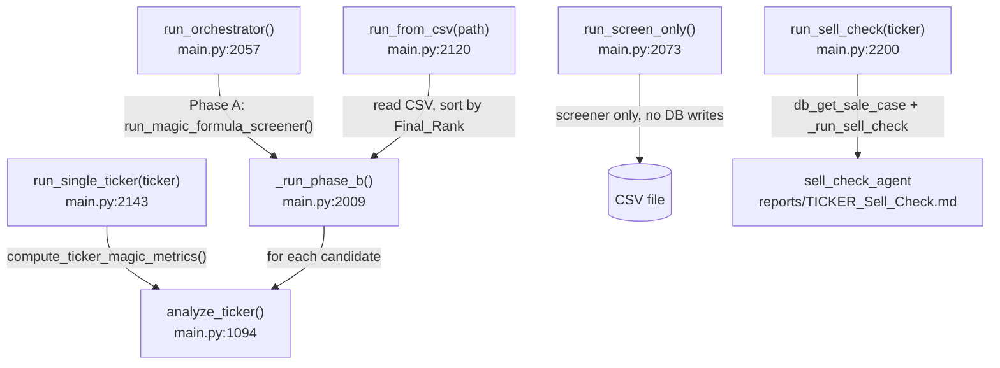

# Orchestration & CLI Walkthrough

Primary file: [`src/main.py`](../src/main.py) (2,372 lines). There is no separate
"orchestrator agent" object; `main.py`'s module-level code builds five `LlmAgent`s
once at import time, and its `if __name__ == "__main__"` block dispatches to one of
five run functions based on CLI flags.

> **There are two more entry points.** [`src/sale_advisory.py`](../src/sale_advisory.py)
> regenerates a Phase C sale advisory for any stored report
> ([10-sale-advisory-regeneration.md](10-sale-advisory-regeneration.md)) — the repair
> tool for a run whose advisory is missing, stale, or was skipped. And
> [`src/refine.py`](../src/refine.py) runs the
> opt-in Phase D critic loop (`python refine.py TICKER`) and is documented in
> [09-critic-and-refinement-loop.md](09-critic-and-refinement-loop.md). It imports
> `main` (for the agents, cost accounting, and report assembly) but `main` never
> imports it — which is why it is a separate command rather than a sixth flag.
> Both are separate commands for the same mechanical reason: `main.py` is run as a
> script, so `import main` from a module `main` imported back would load a **second
> copy** of every agent and re-run the module-level setup. Everything below concerns
> the five modes of `main.py` itself.

## 1. Startup (module load), `main.py:1-120`

Runs once, before any CLI parsing:

- `main.py:22-41` imports every MCP tool wrapper from `mcp_server.py` (this
  also triggers `mcp_server.py`'s own module-level `initialize_database()`
  call at `mcp_server.py:711`, so the DB schema is ensured before anything else runs).
- `main.py:48-67` sets up dual logging (console + `logs/run_<timestamp>.log`).
- `main.py:70-72` loads `src/specs/config.yaml` into the module-level `config` dict.
- `main.py:74` reads `top_n_candidates` (overridable later by `--top-n`).
- `main.py:85` pins `AGENT_MODEL` from `config.yaml`'s `agents.model` —
  deliberately not the moving `gemini-flash-latest` alias (see
  [05-guardrails-cost-and-reuse.md](05-guardrails-cost-and-reuse.md)).
- `main.py:91-103` loads LLM/embedding/Tavily pricing tables used for cost estimates.
- `main.py:108-120` reads the three instruction files
  (`research-instructions.md`, `bullish-research-instructions.md`,
  `sale-advisor-instructions.md`) into strings that get concatenated into
  agent prompts in the next section.

## 2. Agent definitions, `main.py:122-507`

All five `LlmAgent`s (`bear_agent`, `bull_agent`, `analyst_agent`,
`sale_advisor_agent`, `sell_check_agent`) are constructed here, once, at
import time — not per-run. See
[02-agents-and-reasoning-graph.md](02-agents-and-reasoning-graph.md) for the
prompt content; this doc only covers control flow.

`PIPELINE_AGENTS = [bear_agent, bull_agent, analyst_agent, sale_advisor_agent]`
(`main.py:462`) is the ordered list `_run_pipeline_async` walks. It is a plain
Python list, not ADK's `SequentialAgent` class — see §3 below for why.

## 3. Running the reasoning graph, `main.py:880-971` (`_run_pipeline_async`)

This is the function every Phase B/C run eventually calls. Per ticker:

1. Creates one `InMemorySessionService` session keyed `f"{run_id}:{ticker}"`
   (`main.py:895-916`) and seeds it with `ticker`, `company_name`, `sec_data`,
   `metrics_data`, `quarterly_data`, `verified_figures`, `screen_context`.
2. Builds the agent list, dropping `sale_advisor_agent` if
   `skip_sale_advisor` (`main.py:927-928`).
3. For each agent in order (`main.py:929-966`):
   - Builds a fresh `Runner` via `_build_runner` (`main.py:550-559`, attaches
     context-cache config from `App` if `CONTEXT_CACHE_ENABLED`).
   - Runs it against the shared session; the agent's `output_key` (e.g.
     `"bear_data"`) writes its answer into session state.
   - **Retries only that agent** on a 429 (`main.py:938-962`, up to
     `MAX_AGENT_RETRIES = 5` with exponential backoff from
     `BASE_BACKOFF_SECONDS = 20`). This is the reason the graph is a manual
     list instead of ADK's `SequentialAgent`: retrying the *whole* graph on a
     late rate limit used to re-run (and re-pay for) every already-completed
     role — see `main.py:884-894` and
     [agent_architecture.md §5B](../src/specs/agent_architecture.md).
4. Returns `(final_session_state, usage)`.

`run_pipeline` (`main.py:974-992`) is the synchronous wrapper (`asyncio.run`)
that `analyze_ticker` calls; it adds one gentle inter-ticker sleep afterward.

## 4. Per-ticker orchestration, `main.py:1094-1281` (`analyze_ticker`)

The single function every execution mode funnels through for Phase B/C. In order:

1. **Normalize the candidate shape** (`main.py:1117`, `_normalize_candidate`) —
   screener-CSV rows and on-demand single-ticker rows use different field
   names/types; see [05-guardrails-cost-and-reuse.md](05-guardrails-cost-and-reuse.md).
2. **Reuse check** (`main.py:1119-1151`) — before any billed work, look up
   `db_find_reusable_report` by `analysis_key` (a hash of ticker + balance-sheet
   date + prompt version). On a hit, copy the prior run's DB rows
   (`db_copy_ticker_outputs`) and the report file, then return zero usage —
   **no LLM call happens at all**.
3. **Direct data gathering** (`main.py:1153-1174`, no LLM, no tokens):
   `fetch_sec_10k_data`, `fmp_metrics_extractor`, `fmp_quarterly_trends`,
   `_format_verified_figures`. Logs a warning if the candidate is missing the
   debt/cash/EV columns the reconciliation gate needs.
4. **Run the reasoning graph** (`main.py:1179-1182`, calls `run_pipeline` from §3).
5. **Persist everything** (`main.py:1188-1280`):
   - `db_store_agent_output` for `SEC_DATA`/`QUANT_METRICS` (unembedded) and
     `BEAR_CASE`/`BULL_CASE`/`SALE_CASE` (embedded).
   - Run the **reconciliation gate** (`_reconcile_agent_figures`, `main.py:1229-1236`)
     over bear/bull/final/sale text against the verified figures.
   - Extract the verdict (`_extract_verdict`, `main.py:1078-1091`) and prepend
     the deterministic `## Magic Formula Metrics` section
     (`_format_magic_formula_section`) plus any reconciliation warnings.
   - `db_store_final_report`, `db_store_ticker_run`, and write
     `reports/{TICKER}_Final_Report_{Verdict}.md` /
     `reports/{TICKER}_Sale_Advisory.md`.

## 5. The five execution modes, `main.py:2057-2260`

- **`run_orchestrator(force, skip_sale_advisor)`** (`main.py:2057`) — Phase A
  then `_run_phase_b`. Bare `python main.py`.
- **`run_screen_only()`** (`main.py:2073`) — Phase A alone; writes the CSV,
  logs the top N, and returns. No `pipeline_runs` row, no agent calls.
- **`run_from_csv(csv_path, force, skip_sale_advisor)`** (`main.py:2120`) —
  reads the rankings CSV (sorted by `Final_Rank` if present), takes the top
  `top_n`, calls `_run_phase_b`.
- **`run_single_ticker(ticker, company_name, force, skip_sale_advisor)`**
  (`main.py:2143`) — no screener; calls `compute_ticker_magic_metrics` for the
  bull/bear value signal, then `analyze_ticker` directly.
- **`run_sell_check(ticker, company_name, run_id)`** (`main.py:2200`) —
  standalone Phase C follow-up; loads a stored `SALE_CASE`
  (`db_get_sale_case`), fetches current FMP metrics + quarterly trends, runs
  `sell_check_agent` via `_run_sell_check` (`main.py:1034`), writes
  `reports/{TICKER}_Sell_Check.md`. Creates **no** `pipeline_runs` row.

`_run_phase_b(top_candidates, source_label, force, skip_sale_advisor)`
(`main.py:2009`) is shared by `run_orchestrator` and `run_from_csv`: it
creates the parent `pipeline_runs` row (`db_create_pipeline_run`, must happen
**before** any `agent_outputs`/`final_reports` insert — those tables carry an
FK onto it), then loops candidates through `analyze_ticker`, checking the
budget guard (`_check_budget`, `main.py:594`) before each one.

## 6. CLI argument parsing, `main.py:2262-2372`

Standard `argparse`. Notable validation, not just flag definitions:

- `main.py:2339-2340`: `--run` is rejected unless paired with `--sell-check`.
- `main.py:2345-2357`: `--screen-only` rejects being combined with any Phase
  B/C flag (`--from-csv`, `--sell-check`, `--skip-sale-advisor`, `--force`,
  or a bare `TICKER`) rather than silently ignoring them.
- `main.py:2364-2365`: `--skip-sale-advisor` is rejected with `--sell-check`
  (the sell-check flow never runs Phase C in the first place).
- Dispatch (`main.py:2359-2372`) is a simple if/elif chain checking
  `--screen-only` → `--sell-check` → `--from-csv` → `TICKER` → bare
  `run_orchestrator()`.

## Where to look next

- Agent prompts and the exact state keys each one reads/writes:
  [02-agents-and-reasoning-graph.md](02-agents-and-reasoning-graph.md).
- What `fetch_sec_10k_data` / `fmp_metrics_extractor` / `fmp_quarterly_trends`
  actually return: [03-mcp-tools-and-persistence.md](03-mcp-tools-and-persistence.md).
- `_analysis_key`, `_check_budget`, `_reconcile_agent_figures`, and the cost
  accounting functions: [05-guardrails-cost-and-reuse.md](05-guardrails-cost-and-reuse.md).
