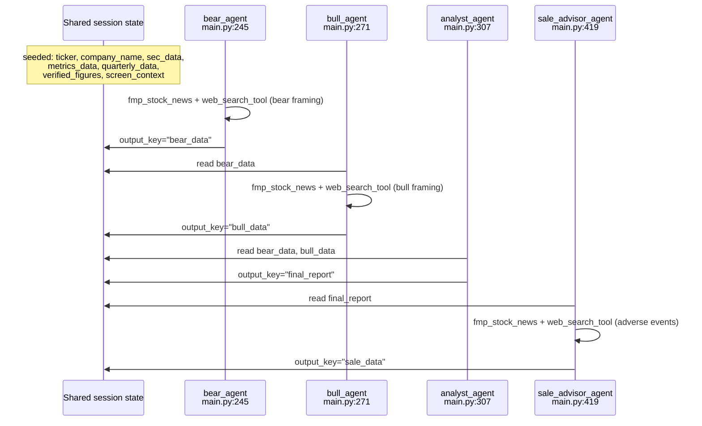

# Agents & Reasoning Graph Walkthrough

All five agents are `google.adk.agents.LlmAgent` instances defined in
[`src/main.py`](../src/main.py). None of them call each other directly —
`_run_pipeline_async` (see
[01-orchestration-and-cli.md](01-orchestration-and-cli.md)) runs them in
order over one shared ADK session, and they communicate only through
session-state keys (`output_key` on write, `{key_name}` templating on read).

There is **no** SEC/metrics/search "agent" — that data is fetched by direct
Python function calls (`fetch_sec_10k_data`, `fmp_metrics_extractor`,
`fmp_quarterly_trends` in `mcp_server.py`) with zero LLM tokens spent, called
directly from `analyze_ticker` (`main.py:1153-1160`) before any agent runs.

## Which tools each agent can call, and where those tools reach

Only two tools are ever wired into an agent's `tools=[...]` — everything else
each agent "sees" arrives pre-fetched, templated into its prompt text (see
[03-mcp-tools-and-persistence.md](03-mcp-tools-and-persistence.md) for full
tool detail):

| Agent | `tools=[...]` (model decides when to call) | External source of those tools | Pre-fetched data templated into the prompt (no LLM in that loop) |
| :--- | :--- | :--- | :--- |
| `bear_agent` | `fmp_stock_news`, `web_search_tool` | FMP `/stable/news/stock`; Tavily Search API | SEC 10-K text (SEC EDGAR), annual metrics (FMP), quarterly trends (FMP), Magic Formula context, verified figures |
| `bull_agent` | `fmp_stock_news`, `web_search_tool` | FMP `/stable/news/stock`; Tavily Search API | Same as bear, plus `bear_data` (the bear agent's own output) |
| `analyst_agent` | *(none — `tools=[]`)* | — | `bear_data`, `bull_data`, Magic Formula context, verified figures, quarterly trends |
| `sale_advisor_agent` | `fmp_stock_news`, `web_search_tool` | FMP `/stable/news/stock`; Tavily Search API | `final_report` (the analyst's verdict + reasoning), verified figures, quarterly trends |
| `sell_check_agent` | `fmp_stock_news`, `web_search_tool` | FMP `/stable/news/stock`; Tavily Search API | Stored sale conditions (from PostgreSQL `agent_outputs`), freshly-fetched current metrics + quarterly trends (FMP) |

Every agent's data — whether tool-fetched live or pre-fetched into the
prompt — ultimately comes from one of four external systems: **FMP**
(financials, news, screener), **SEC EDGAR** (filing text), **Tavily**
(open-web search), or the pipeline's own **PostgreSQL** database (prior
`SALE_CASE` conditions). No agent has direct database or filesystem access —
all persistence happens in `analyze_ticker` after the agents return.

## Shared prompt fragments, `main.py:142-241`

Three string constants get concatenated into multiple agents' instructions
rather than duplicated:

| Constant | Line | Purpose |
| :--- | :--- | :--- |
| `RECENCY_MANDATE` | `main.py:142` | Forces every reasoning role to read `QUARTERLY_DATA` and state whether the latest quarter confirms/contradicts the annual trend, before concluding anything. |
| `REFERENCE_DATA_BLOCKS` | `main.py:180` | The `<MAGIC_FORMULA_CONTEXT>` / `<VERIFIED_FIGURES>` / `<QUARTERLY_DATA>` XML-ish blocks, given to every reasoning agent. |
| `RESEARCH_SOURCE_BLOCKS` | `main.py:190` | The `<METRICS_DATA>` / `<SEC_DATA>` blocks, given **only** to the two advocates (bear/bull) — the judge and sale advisor work from the advocates' arguments plus verified figures, not the raw filing dump, to save ~10k tokens/turn. |
| `VERIFIED_FIGURES_MANDATE` | `main.py:195` | Forbids any agent from stating a debt/cash/market-cap/EV figure that contradicts the deterministically-computed `VERIFIED_FIGURES` block. |

`PIPELINE_INCLUDE_CONTENTS = "none"` (`main.py:241`) is set on every reasoning
agent's `include_contents`, so each agent only sees the current turn (its own
tool calls), not the whole prior transcript of earlier agents' turns. See the
long comment at `main.py:210-240` for the token-cost measurements that
justified this.

## The four Phase B/C roles, `main.py:245-462`

### `bear_agent` — `main.py:245-268`

- Instruction = `research-instructions.md` (see structure below) + an
  appended "How to run this research" block + `RECENCY_MANDATE` +
  `VERIFIED_FIGURES_MANDATE` + `REFERENCE_DATA_BLOCKS` + `RESEARCH_SOURCE_BLOCKS`.
- `tools=[fmp_stock_news, web_search_tool]`, `output_key="bear_data"`.
- `research-instructions.md` sections (used as the skeleton the bear case must
  answer): `# Goal`, `# Must follow instructions`, `# Key metrics for Business
  Types`, `# Assumptions`, then `# Research Instructions` with `## Basic
  Company Info Questions`, `## Business Model Questions`, `## Key numbers`,
  `## Comparitive analysis`, `## Valuation analysis`, `## Risk analysis`.
  `main.py:257` refers to the "Key numbers" section as "3." by its position
  in that list (Basic Info=1, Business Model=2, Key numbers=3).

### `bull_agent` — `main.py:271-304`

- Instruction = `bullish-research-instructions.md` + a "How to run this
  research" block + `RECENCY_MANDATE` + `VERIFIED_FIGURES_MANDATE` + a
  CONFIRMED/SPECULATIVE catalyst-labeling instruction + `REFERENCE_DATA_BLOCKS`
  + `RESEARCH_SOURCE_BLOCKS` + `<BEAR_CASE>{bear_data}</BEAR_CASE>`.
- `tools=[fmp_stock_news, web_search_tool]`, `output_key="bull_data"`.
- `bullish-research-instructions.md` sections: `## 1. Capital Allocation &
  Compounding Efficiency`, `## 2. Unlocking Growth Catalysts & Optionality`,
  `## 3. Expectations Check & Upside Scenario`, `## 4. Direct Refutation of
  the Bear Case` — §4 is why `bull_agent` must run **after** `bear_agent`
  (it needs `bear_data` in context to refute).

### `analyst_agent` — `main.py:307-412`

- No skeptical or promotional instruction file — the entire prompt is
  written inline in `main.py`. No `tools` (`tools=[]`) — it reasons over
  `bear_data`/`bull_data`/`VERIFIED_FIGURES`/`QUARTERLY_DATA` only, no new
  research.
- Required output sections (enforced by prompt, not code):
  `## Recent Quarter Check`, `## Bull Case (summary)`, `## Bear Case
  (summary)`, `## Final Verdict`, `## What Would Make This Wrong`.
- `output_key="final_report"`. This string is what `_extract_verdict`
  (`main.py:1078`) parses and what gets persisted via `db_store_final_report`.
- Verdict vocabulary: `Buy` / `Watch` / `Avoid`, always for a reader who does
  **not** currently own the stock.

### `sale_advisor_agent` — `main.py:419-452`

- Instruction = `sale-advisor-instructions.md` (plain prose, no `##`
  sub-headers) + a "How to run this analysis" block +
  `VERIFIED_FIGURES_MANDATE` + an anchoring requirement (every numeric
  threshold must cite the current actual value alongside it) +
  `<VERIFIED_FIGURES>`/`<QUARTERLY_DATA>`/`<FINAL_REPORT>` blocks.
- `tools=[fmp_stock_news, web_search_tool]`, `output_key="sale_data"`.
- Ignores the verdict; assumes the stock is already owned. Names **three**
  measurable, non-price-based sell triggers.
- Dropped by `--skip-sale-advisor` (`main.py:927-928` filters it out of the
  agent list before the loop runs) — see `_run_pipeline_async`.

## The standalone follow-up role, `main.py:471-507`

### `sell_check_agent`

- Not in `PIPELINE_AGENTS`; run only by `_run_sell_check_async`
  (`main.py:995-1031`), invoked from `run_sell_check` (`main.py:2200`).
- Reads `{sale_conditions}` (loaded from a stored `SALE_CASE` via
  `db_get_sale_case`), `{quarterly_data}`, `{metrics_data}` — all freshly
  fetched at check time, not from the original analysis run.
- Marks each condition MET / NOT MET / UNCLEAR and writes a single
  `Recommendation: SELL` (any condition clearly met) or `Recommendation:
  HOLD` line, parsed by `_extract_recommendation` (`main.py:2194`).

## Rate-limit handling shared by every agent call

`_is_rate_limit_error` (`main.py:562`) detects Gemini's HTTP 429
(`RESOURCE_EXHAUSTED`). Retry policy constants (`main.py:514-517`):

- `MAX_AGENT_RETRIES = 5`
- `BASE_BACKOFF_SECONDS = 20` (exponential: `20 * 2**attempt`)
- `INTER_CALL_DELAY_SECONDS = 2`, `INTER_AGENT_DELAY_SECONDS = 1` — gentle
  throttling between ticker/agent calls even on success.

## Where to look next

- What `fmp_stock_news`, `web_search_tool`, `fmp_quarterly_trends`, and the
  `db_*` tools actually do:
  [03-mcp-tools-and-persistence.md](03-mcp-tools-and-persistence.md).
- How `_extract_verdict`, the reconciliation gate, and verified figures work:
  [05-guardrails-cost-and-reuse.md](05-guardrails-cost-and-reuse.md).
