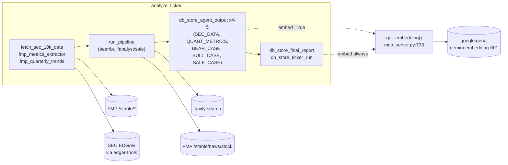

# MCP Tools & Persistence Walkthrough

Primary file: [`src/mcp_server.py`](../src/mcp_server.py) (1,154 lines).
Module load (`mcp_server.py:711`, `initialize_database()`) also ensures the
Postgres schema exists the moment `main.py` imports this module — see
[sql-schema.sql](../src/sql-schema.sql) for the authoritative DDL this mirrors.

## Are these actually MCP tools?

Every function below is decorated `@mcp.tool()` against a `FastMCP` server
instance (`mcp = FastMCP("MagicFormulaSkepticalDecomposer")`,
`mcp_server.py:21`). That decoration registers each function so
`mcp_server.py` **could** be run standalone as a real MCP server
(`mcp_server.py:1153-1154`: `if __name__ == "__main__": mcp.run()`), speaking
the Model Context Protocol over stdio/SSE to any MCP-compatible client.

**In this codebase, that server is never actually started.** `main.py` does
`from mcp_server import (...)` (`main.py:22-41`) and imports the plain Python
functions directly, in-process — the `@mcp.tool()` decorator returns the
original callable unchanged, so it's simultaneously (a) MCP-servable if you
ever ran `python mcp_server.py` standalone, and (b) an ordinary Python
function today. Two different consumption paths follow from that:

- **Given to an `LlmAgent`'s `tools=[...]`** (`fmp_stock_news`,
  `web_search_tool`) — ADK wraps the plain callable as a `FunctionTool` and
  the *model* decides when to call it, mid-conversation, based on its own
  reasoning. This is the "agent tool" path.
- **Called directly by orchestration code** (everything else — the screener,
  SEC/FMP data gathering, every `db_*` function) — plain synchronous Python
  calls from `analyze_ticker`/`run_*` with no LLM involved in the decision to
  call them or in reading their output before it's templated into a prompt.

## Tool inventory: source & data nature

| Tool | Line | Invocation path | External source | Nature of data | Credential |
| :--- | ---: | :--- | :--- | :--- | :--- |
| `run_magic_formula_screener` | `mcp_server.py:39` | Direct | FMP `/stable/company-screener` + statement endpoints (via the screener script) | Structured JSON, live market data + latest filings | `FMP_API_KEY` |
| `compute_ticker_magic_metrics` | `mcp_server.py:60` | Direct | FMP `/stable/market-capitalization` + statement endpoints | Structured JSON, live market cap + latest filings | `FMP_API_KEY` |
| `fetch_sec_10k_data` | `mcp_server.py:150` | Direct | SEC EDGAR (via the `edgar-tools`/`edgar` Python package) | Unstructured filing text (Item 1 business description, risk factors) | none (SEC requires only a descriptive `User-Agent` string, `SEC_USER_AGENT`) |
| `fmp_metrics_extractor` | `mcp_server.py:256` | Direct | FMP `/stable/key-metrics`, `/ratios`, `/ratings-snapshot`, `/price-target-consensus`, `/grades-consensus`, `/stock-peers` | Structured JSON, **annual** fundamentals + analyst opinion | `FMP_API_KEY` |
| `fmp_quarterly_trends` | `mcp_server.py:343` | Direct | FMP `/stable/income-statement`, `/cash-flow-statement`, `/balance-sheet-statement` (`period=quarter`) | Structured JSON → rendered as markdown tables, **quarterly** fundamentals | `FMP_API_KEY` |
| `fmp_stock_news` | `mcp_server.py:485` | **Agent tool** (bear/bull/sale/sell-check) | FMP `/stable/news/stock` | Unstructured news headlines + snippets, ticker-tagged, factual | `FMP_API_KEY` |
| `web_search_tool` | `mcp_server.py:523` | **Agent tool** (bear/bull/sale/sell-check) | Tavily Search API (`api.tavily.com/search`) | Unstructured open-web search results + a synthesized answer, qualitative | `TAVILY_API_KEY` |

All FMP and Tavily calls are plain `requests` HTTP calls (no SDK); SEC access
goes through the third-party `edgar-tools` package's `Company`/`set_identity`
API. None of these seven tools touch the database — that's the separate
inventory below.

### Why two data shapes for ROC/EY

`compute_ticker_magic_metrics` and the screener's CSV output both come from
`compute_company_metrics_detailed` (`magic_formula_starter_screener.py:360`),
but they present the ratios differently — one as raw floats, one as `_Pct`
strings — and one field is `NaN` while the other is `None` on a missing
value. `_normalize_candidate` (`main.py:1751`) exists specifically to paper
over this before any report code reads a candidate dict; see
[05-guardrails-cost-and-reuse.md](05-guardrails-cost-and-reuse.md) and
[agent_architecture.md §2.I](../src/specs/agent_architecture.md).

## Database layer

`get_db_connection` (`mcp_server.py:570`) opens a plain `psycopg2` connection
per call — there is no connection pool. `initialize_database`
(`mcp_server.py:576-709`) is idempotent (`CREATE TABLE IF NOT EXISTS`, `ADD
COLUMN IF NOT EXISTS`) so it is safe to run on every process start, including
migrating pre-existing tables (e.g. adding `analysis_key`, `magic_rank`,
dropping legacy Brave-search columns).

All eleven of these are also `@mcp.tool()`-decorated but, like the data-fetch
tools above, are **called directly** by orchestration code in `main.py` —
none is given to an `LlmAgent`'s `tools=[...]`. The source for all of them is
the same self-hosted PostgreSQL database (`DATABASE_URL`), the one place in
this codebase that is not a third-party API.

| Tool | Line | Source table(s) | Nature of data | Purpose |
| :--- | ---: | :--- | :--- | :--- |
| `db_create_pipeline_run` | `mcp_server.py:784` | `pipeline_runs` (write) | Relational row, run metadata | Insert the parent row. **Must** happen before any `agent_outputs`/`final_reports` insert (FK constraint). |
| `db_update_pipeline_status` | `mcp_server.py:807` | `pipeline_runs` (write) | Relational row, status string | Set `pipeline_runs.status` mid-run. |
| `db_finalize_pipeline_run` | `mcp_server.py:824` | `pipeline_runs` (write) | Relational row, aggregated usage/cost | Terminal update: status + aggregated token/search usage + cost. |
| `db_store_agent_output` | `mcp_server.py:867` | `agent_outputs` (write) | Raw text + optional 768-dim vector | Insert into `agent_outputs`; embeds via `get_embedding` when `embed=True`. |
| `db_find_reusable_report` | `mcp_server.py:892` | `final_reports` (read) | Relational row + markdown text | Look up a row by `(ticker, analysis_key)` younger than `max_age_hours`. Backs the duplicate-run skip. |
| `db_copy_ticker_outputs` | `mcp_server.py:936` | `final_reports`, `agent_outputs` (read+write) | Relational rows + vectors, copied as-is | Copy a report + all agent outputs from one `run_id` to another (embeddings copied, not regenerated). |
| `db_spend_since` | `mcp_server.py:973` | `pipeline_runs` (read) | Aggregate (`SUM`) | Total estimated spend in the last N hours. Backs the rolling daily budget ceiling. |
| `db_store_final_report` | `mcp_server.py:996` | `final_reports` (write) | Markdown text + 768-dim vector | Insert; normalizes verdict to `BUY`/`WATCH`/`AVOID` (default `WATCH` if unrecognized). |
| `db_store_ticker_run` | `mcp_server.py:1026` | `ticker_runs` (write) | Relational row | Upsert the per-ticker index row (`ON CONFLICT (ticker, run_id) DO UPDATE`) — drives the web UI. |
| `db_search_historical_reports` | `mcp_server.py:1063` | `final_reports` (read) | Vector cosine similarity (`<=>`) | Semantic search over stored reports. Not called anywhere in `main.py` today — available for ad hoc / future use. |
| `db_get_sale_case` | `mcp_server.py:1107` | `agent_outputs` (read, `agent_type='SALE_CASE'`) | Raw text | Fetch the latest (or a pinned `run_id`'s) sale-condition text for `run_sell_check`. |

## Embeddings, `mcp_server.py:713-781`

Not a `@mcp.tool()` itself — `get_embedding` is a plain helper called from
inside `db_store_agent_output` and `db_store_final_report`. Its external
source is **Google's Generative AI API** (`google.genai`), the same provider
as the reasoning agents' LLM calls but a different endpoint/model
(`embed_content` vs. `generate_content`), so it needs the same
`GOOGLE_API_KEY` the agents use.

`get_embedding(text)` (`mcp_server.py:733`) calls `google.genai`'s
`embed_content` with `model="gemini-embedding-001"` and
`output_dimensionality=768` (to match the schema's `vector(768)` columns). On
any failure (missing `GOOGLE_API_KEY`, API error, wrong dimension count) it
logs an ERROR — the first 3 per process in full, then suppressed — and
returns a **zero vector**, so a row that failed to embed is still stored but
silently unsearchable by `db_search_historical_reports`. This replaced an
earlier bug where every embedding call failed silently
(`google.generativeai`, an uninstalled legacy SDK, wrapped in a bare
`except: pass`) — see the docstring at `mcp_server.py:736-746` and
[agent_architecture.md §5B "Embeddings were silently broken"](../src/specs/agent_architecture.md).

`EMBEDDING_USAGE` (`mcp_server.py:717`) is a module-level counter of
characters/requests, drained by `drain_embedding_usage()`
(`mcp_server.py:720`) — `main.py`'s `_collect_embedding_usage` calls this
after each ticker to fold embedding cost into the per-ticker total (embeddings
carry no usage metadata from the API, so cost is approximated at 4 chars/token).

## Where to look next

- How `main.py` calls these tools per-ticker:
  [01-orchestration-and-cli.md](01-orchestration-and-cli.md).
- The screener script these tools wrap:
  [04-screener-internals.md](04-screener-internals.md).
- Cost accounting built on top of `EMBEDDING_USAGE` and `db_spend_since`:
  [05-guardrails-cost-and-reuse.md](05-guardrails-cost-and-reuse.md).
