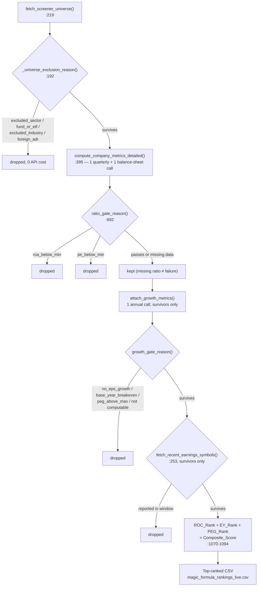

# Screener Internals Walkthrough (Phase A)

Primary file:
[`src/magic_formula_starter_screener.py`](../src/magic_formula_starter_screener.py)
(1,172 lines). Runs as a plain script (`main()`) invoked either directly
(`python magic_formula_starter_screener.py`) or wrapped by
`run_magic_formula_screener` in `mcp_server.py:40`. Its output — a ranked CSV
— is the sole hand-off to Phase B; there is no in-memory sharing between this
script and `main.py` beyond that file (and, for a single ticker, the
`compute_company_metrics_detailed` function imported directly).

## Configuration load, `magic_formula_starter_screener.py:16-121`

Reads `screening_parameters:` from `src/specs/config.yaml` into module-level
constants (`MIN_MARKET_CAP`, `UNIVERSE_LIMIT`, `MIN_ROA`, `ROA_BASIS`,
`MIN_PE`, `RECENT_EARNINGS_DAYS`, `MIN_EPS_GROWTH`, `MAX_PEG`,
`EPS_GROWTH_YEARS`, `EPS_GROWTH_METHOD`, `MAX_GROWTH_FOR_PEG`,
`MIN_BASE_NET_MARGIN`, `EXCLUDED_SECTORS`,
`EXCLUDED_INDUSTRIES`, `EXCLUDE_ADR`, `ALLOWED_COUNTRIES`). Any gate threshold
can be set to `null` in `config.yaml` to disable that gate entirely — see the
checks at each gate site below.

`OUTPUT_FILENAME` (`:33`) and `HISTORY_DIR` (`:36`) are anchored to
`os.path.dirname(__file__)` rather than the current working directory —
important because `mcp_server.py` and `webapp/app.py` both need to find the
same stable file regardless of where the process was launched from.

## `fmp_get`, `magic_formula_starter_screener.py:132-173`

Shared HTTP helper (also used by `compute_company_metrics_detailed`). Retries
transient failures — timeouts, `RETRYABLE_STATUS = {429, 500, 502, 503,
504}`, and FMP's quirk of returning rate-limit/plan errors as an HTTP 200
carrying `{"Error Message": ...}` — with exponential backoff
(`HTTP_BACKOFF_BASE * 2**(attempt-1)`, default base 1.0s, 3 attempts). Raises
`FMPError` (a plain `Exception` subclass, `:124`) with a human-readable
message on exhaustion or a non-retryable 4xx.

## Eligibility gates, applied in this order

1. **Universe exclusions** — `_universe_exclusion_reason` (`:192-216`),
   applied inside `fetch_screener_universe` (`:219-251`) to the raw FMP
   screener response, **before any per-company financial statement is
   fetched**. Order of checks: missing symbol → `sector` in
   `EXCLUDED_SECTORS` → `isEtf`/`isFund` flags → `industry` substring match
   against `EXCLUDED_INDUSTRIES` (catches banks/insurers/REITs/SPACs filed
   under sectors not in the sector list) → `is_adr()` (`:176-189`, name
   markers like "ADR"/"ADS" or a non-US `country`; a **blank** country is
   treated as unknown, not foreign).
2. **ROA ≥ `min_roa`** and **P/E ≥ `min_pe`** — `ratio_gate_reason`
   (`:692-717`), called from `main()`'s per-symbol loop (`:973-987`) after
   `compute_company_metrics_detailed` runs, but **before** ranking. `roa_basis`
   (`config.yaml`) picks `ROA` (EBIT basis) or `ROA_NetIncome` via
   `selected_roa` (`:685-689`). A P/E gate only fires on a **positive** P/E
   below the floor — loss-makers have no P/E and are already excluded by the
   negative-EBIT check inside `compute_company_metrics_detailed`. Missing
   ratios never cause a drop (a provider gap ≠ a business failing the test).
3. **EPS growth > 0, base window ≥ `min_base_net_margin`, and PEG ≤ `max_peg`** —
   `growth_gate_reason`, fed by `attach_growth_metrics` which is called from
   `main()`'s loop **only when gate 2 passed**, because it costs a third API call
   (`/stable/income-statement`, annual). Peter Lynch's test, not Greenblatt's —
   see §10 of [`agent_architecture.md`](../src/specs/agent_architecture.md) for
   the full rationale, the 189-company study behind each threshold, and the
   verification tables. Four behaviours differ from every other gate here:
   - **Missing data IS a rejection** (`growth_unavailable` / `peg_unavailable` /
     `base_margin_unavailable`), because `1/PEG` feeds the ranking and a survivor
     without one cannot be ranked. Each cause keeps a distinct reason and
     `main()` prints the split, so a provider outage shows as a count rather than
     a silently shorter list.
   - The **growth rate is measured as multi-year TOTALS** by default
     (`eps_growth_method: "sums"` in `fetch_eps_growth`): the last N years' total
     EPS against the prior N years' total, so a loss year inside the window is
     counted at its real negative value instead of being stepped over. Needs 2N
     annual filings. `"endpoint"` restores the original two-point CAGR.
   - The **base window must have been a real trading period** — net margin ≥ 3%,
     a scale-free test that an absolute dollar EPS floor cannot express. See
     §10.D, including why "base EPS vs the company's own peak" was rejected.
   - `compute_peg` divides by the growth rate in **percentage points** — a P/E of
     20 on 20% growth is a PEG of 1.0, not 100 — and returns `None` rather than a
     negative number, which would sort as the cheapest thing on the list.
4. **No earnings in the last N days** — `fetch_recent_earnings_symbols`
   (`:253-349`), run once over all survivors (`main()` `:1017-1034`). Prefers
   one bulk `/stable/earnings-calendar` call; falls back to per-symbol
   `/stable/earnings` only if that endpoint is unavailable, and only for the
   already-narrowed survivor list. If **neither path works**, the filter is
   reported as **not applied** (`ok=False`) rather than silently passing
   everyone through.

## Metrics computation, `compute_company_metrics_detailed`, `:395-683`

The core per-company math (called once per survivor of gate 1, and directly
by `compute_ticker_magic_metrics` in `mcp_server.py:61` for on-demand
tickers). Returns `{"ok": False, "reason": ..., "message": ...}` on any
disqualifying condition instead of raising, via the `_skip()` helper
(`:388-394`), so callers can render *why* a company or ticker has no ratios.

Key formulas:

- **EBIT** — TTM (sum of last 4 quarters' `operatingIncome`) preferred;
  falls back to the latest annual filing if quarterly data is short
  (`EBIT_Basis` field records which). Rejects `ebit <= 0` outright
  (`reason="negative_ebit"`) since both ratios divide by it.
- **Capital Employed** = net working capital (with an *excess-cash*
  carve-out, floored at 0 — see the long comment at `:529-545` for why this
  keeps asset-light net-cash companies like ADBE from being wrongly dropped
  or inflated) **+ net fixed assets** (`propertyPlantEquipmentNet`).
- **Enterprise Value** = market cap + total debt + preferred + minority
  interest − cash. Rejected if ≤ 0 (`reason="negative_enterprise_value"`).
- **ROC** = EBIT / Capital Employed. **Earnings Yield** = EBIT / Enterprise Value.
  These two, ranked, are the actual Magic Formula.
- **ROIC_InclGoodwill** = EBIT / (equity + debt + minority − cash)
  ("invested capital", includes goodwill/intangibles unlike ROC). `None`
  when invested capital is non-positive (heavy-buyback companies like BKNG,
  WINA) — the reason (`negative_invested_capital` / `not_computable`) is
  carried in `ROIC_Unavailable_Reason` rather than left unexplained.
- **ROA** (two bases) = EBIT / TotalAssets, or NetIncome / TotalAssets. This
  is the gate figure (step 1 above), never the ranking figure.
- **P/E** = market cap / TTM net income (avoids a per-share/share-count
  dependency); `None` for non-positive net income.

The growth figures are **not** computed here — they need a third API call, so
they are attached separately by `attach_growth_metrics` (`:908-921`) only for
companies that cleared the ratio gates:

- **EPS growth** = `(EPS_latest_FY / EPS_FY-N) ** (1/N) - 1`, from annual
  filings, diluted EPS preferred and the *same* measure required at both ends.
  `None` with a stated reason for a non-positive base or current EPS, too short
  a history, a stale annual, or a fetch failure.
- **PEG** = P/E ÷ (growth × 100), capped by `max_growth_rate_for_peg` (60%) on
  the denominator only — see `peg_growth_rate` and §10.F. `None` whenever either
  input is missing or non-positive. Note the cap implies a hard P/E ceiling for
  the whole screen of `max_peg × max_growth_rate_for_peg × 100` = 90; review the
  two knobs together.
- **BaseNetMargin** = net income ÷ revenue summed over the BASE window, the
  scale-free "was this a real starting period" test enforced by the gate.

## Ranking & output, `main()`, `:936-1171`

1. Fetch universe → per-company metrics → gates 1–3 (above), printing gate
   drop counts as it goes.
2. **Data-basis integrity check** (`:1054-1066`): warns if ≥5% of the surviving
   universe fell back to `Annual` EBIT instead of `TTM` — a signal that FMP
   may have restricted quarterly access, which would otherwise silently mix
   TTM and annual bases in one ranking.
3. **Ranking** (`:1070-1094`): `ROC_Rank`, `EY_Rank` and `PEG_Rank` are
   independent percentile ranks (`ascending=False`, ties get `method="min"`).
   `PEG_Rank` ranks `InversePEG` (= `1/PEG`) so all three point the same way —
   higher is better — with `na_option="bottom"` so a missing PEG ranks last
   instead of turning the composite into `NaN`. `MagicFormula_Score =
   ROC_Rank + EY_Rank` keeps Greenblatt's pure score visible;
   `Composite_Score = MagicFormula_Score + PEG_Rank` is what the list is
   ordered by, and `Final_Rank` is the rank of that (lower = better).
4. **Output** (`:1120-1167`): writes a timestamped archive to
   `rankings_history/` plus overwrites the stable `magic_formula_rankings_live.csv`
   (`OUTPUT_FILENAME`). Warns if fewer than 30 companies survive — Phase B
   expects a top 30, so a short list is a signal the gates are mistuned, not
   a stricter screen working as intended.

## Where to look next

- How `main.py` consumes this CSV (`--from-csv`) or calls the screener
  directly (`run_orchestrator`): [01-orchestration-and-cli.md](01-orchestration-and-cli.md).
- The two different shapes a "candidate" dict takes depending on whether it
  came from this CSV or from `compute_ticker_magic_metrics`, and how
  `_normalize_candidate` reconciles them:
  [05-guardrails-cost-and-reuse.md](05-guardrails-cost-and-reuse.md).
