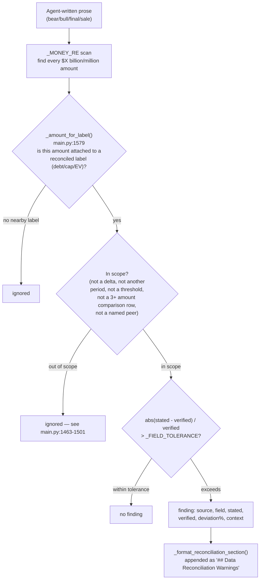
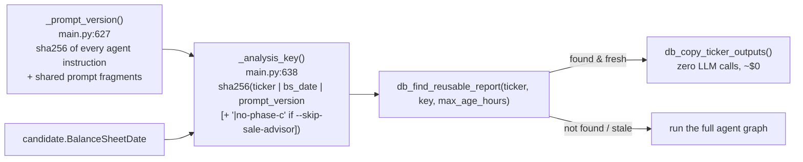
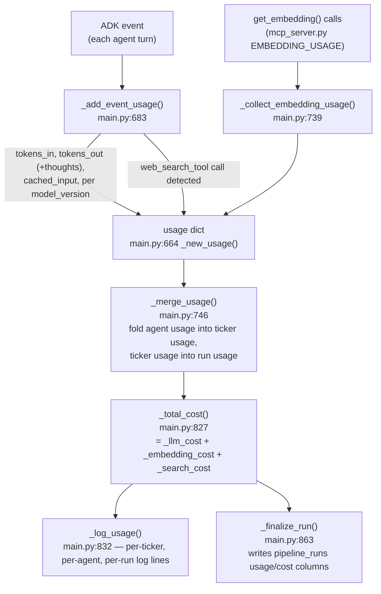

# Guardrails, Cost Accounting & Reuse Walkthrough

All in [`src/main.py`](../src/main.py). These are the deterministic (no-LLM)
mechanisms wrapped around the agent calls — they run in plain Python, reading
and post-processing what the agents produce rather than being part of the
prompt-driven reasoning itself.

## 1. Candidate normalization, `main.py:1725-1779`

A "candidate" dict (one company's Magic Formula figures) reaches
`analyze_ticker` from two different code paths that disagree on shape:

| | Screener CSV (`--from-csv`, full pipeline) | Single-ticker (`compute_ticker_magic_metrics`) |
| :--- | :--- | :--- |
| Ratio fields | raw floats, e.g. `ROIC_InclGoodwill` | percent strings, e.g. `ROIC_InclGoodwill_Pct` |
| Missing value | `NaN` (via pandas) — **truthy in Python** | `None` — falsy |

- `_present(value)` (`main.py:1725`) collapses `None`, `NaN`, and the
  strings `"nan"`/`"none"` to a single `None`, so every downstream `if
  value:` check behaves the same regardless of which path the candidate came
  from.
- `_normalize_candidate(candidate)` (`main.py:1751`) derives the missing
  `_Pct` fields from the raw ratio columns per `_RATIO_TO_PCT_FIELD`
  (`main.py:1743`), called as the **first line** of `analyze_ticker`
  (`main.py:1117`) before anything else reads the dict. Without this, the
  goodwill-inclusive ROIC companion silently disappeared from every batch
  run — see the docstring for the incident this fixed.

## 2. Verified figures, `main.py:1284-1419`

The deterministic ground truth injected into every agent's prompt, so no
agent can assert a debt/cash/market-cap/EV figure the pipeline's own
calculation disagrees with.

- `_verified_figures(candidate)` (`main.py:1348`) extracts the numeric subset
  (`TotalDebt`, `Cash`, `TotalEquity`, `TotalAssets`,
  `GoodwillAndIntangibles`, `InvestedCapital`, `EnterpriseValue`,
  `LiveMarketCap`, `EBIT`, `CapitalEmployed`) as a plain `{field: float}` dict.
  This same dict is what the reconciliation gate (below) checks agent prose
  against.
- `_format_verified_figures(candidate)` (`main.py:1365`) renders it as
  prose for the `VERIFIED_FIGURES` prompt block, including Lynch's P/E,
  growth rate and PEG (spec §10) and the ROC vs.
  goodwill-inclusive-ROIC pairing (§2.F in the spec) and the ROA fallback
  note when ROIC can't be computed (negative invested capital from heavy
  buybacks).

## 3. Reconciliation gate, `main.py:1422-1698`

Runs **after** the agents finish (`analyze_ticker`, `main.py:1229-1236`),
scanning bear/bull/final/sale prose for dollar amounts presented as current
total debt, market cap, or enterprise value, and flagging any that deviate
from the verified figure beyond a per-field tolerance
(`_FIELD_TOLERANCE`, `main.py:1457-1461`: 10% debt, 20% EV, 25% market cap —
different tolerances because debt is a slow accounting figure and market cap
is a live, legitimately-drifting price).

Key design decisions (each exists because a naive version produced false
positives on **correct** reports — see the long comments at `main.py:1506-1570`):

- **Label association is directional, not nearest-match.** An amount
  *immediately before* a label wins first ("$36.9 billion debt burden");
  otherwise the first amount *after* the label wins, but only through a
  whitelisted connector (`of`, `is`, a table pipe, a parenthetical) — a comma
  starts a new clause and breaks the association.
- **Threshold language is excluded.** "Total debt above $32B" is a sell
  trigger (a level not yet reached), not a claim about today — `_THRESHOLD_RE`
  (`main.py:1493`) scans the text *before* the number.
- **Comparison rows (3+ amounts on one line) are skipped entirely** — a
  multi-year history or peer table where the gate cannot tell which column is
  "current."
- **Delta and other-period language is excluded** — "debt rose *by* $11B",
  "debt was $24.4B *in 2023*".

A clean pass (`recon_findings == []`) means "nothing contradicts our own
basis," never "everything in this report is true." Regression tests:
[`src/test_reconciliation.py`](../src/test_reconciliation.py) (38 cases from
real FISV/VICR/SOLV runs, offline, no API keys).

## 4. Budget guard, `main.py:594-618` (`_check_budget`)

Checked **between tickers**, never mid-ticker (a partial ticker is still
billed, so stopping halfway would waste rather than save). Reads
`budget:` from `config.yaml` (`per_run_usd`, `per_day_usd` +
`day_window_hours` as a rolling window via `db_spend_since`,
`on_exceed: halt|warn`). On `halt`, raises `BudgetExceeded`
(`main.py:577`), caught in `_run_phase_b` (`main.py:2036-2040`), which marks
the run `BUDGET_EXCEEDED` (not `COMPLETED`) but keeps everything already
analyzed. `--no-budget` disables the guard for one invocation
(`main.py:2325-2327`, flips the module-level `BUDGET_ENABLED`).

## 5. Duplicate-run reuse, `main.py:627-661`

- `_prompt_version()` (`main.py:627`) hashes every `PIPELINE_AGENTS` agent's
  `instruction` plus the shared fragments — editing any prompt invalidates
  reuse for everyone, rather than silently serving reports written under old
  rules.
- `_analysis_key(ticker, candidate, skip_sale_advisor)` (`main.py:638`)
  fingerprints on the **balance-sheet date**, not today's date — two runs a
  day apart against the same filing are the same analysis. `skip_sale_advisor`
  is folded into the key so a cheap Phase-B-only report is never reused to
  satisfy a request for a full Phase-B+C report (or vice versa). Returns
  `""` (disabling reuse) when the balance-sheet date is unknown.
- Reuse is checked at the top of `analyze_ticker` (`main.py:1119-1151`),
  before any billed work — a hit costs one DB read plus a row copy, a miss
  costs nothing extra. `reuse.enabled`/`reuse.max_age_hours` in `config.yaml`;
  `--force` bypasses the check entirely regardless of config.
- Regression tests: [`src/test_guards.py`](../src/test_guards.py).

## 6. Cost accounting, `main.py:664-877`

- `_new_usage()` (`main.py:664`) is the accumulator shape: flat
  input/output/total/cached/embed counters plus a `by_model` breakdown
  (because pricing is keyed by the **resolved** model version the API
  actually billed, not the alias configured on the agent — see
  `config.yaml`'s `llm_pricing.models` and the commentary at `main.py:76-90`
  about a prior 3.5x silent cost blowup from an unpinned alias).
- `_add_event_usage(usage, event)` (`main.py:683`) reads
  `event.usage_metadata` per ADK event, folding `thoughts_token_count` into
  the output counter (thinking models bill it at the output rate) and
  `cached_content_token_count` separately (billed at 1/10th the input rate).
  Also counts each `web_search_tool` function-call event as one Tavily
  request — `fmp_stock_news` calls are **not** counted here (FMP is
  subscription-metered, not billed per call).
- `_merge_usage(acc, other)` (`main.py:746`) folds one usage dict into
  another, per-model-bucket-aware — a past bug dropped `cached_input` during
  merge, silently re-pricing every cached token at the full rate once rolled
  up to the run total.
- `_model_price` / `_model_cost` / `_llm_cost` / `_embedding_cost` /
  `_search_cost` / `_total_cost` (`main.py:765-830`) turn token/request
  counts into dollars using `config.yaml`'s `llm_pricing`/`search_pricing`
  tables. An unpriced model is logged loudly and excluded from the total
  (a known lower bound), never silently priced at zero.
- `_finalize_run(run_id, usage, run_label, status)` (`main.py:863`) writes
  the aggregated usage/cost onto the `pipeline_runs` row via
  `db_finalize_pipeline_run`.

## 7. What the Phase D critic loop reuses from this file

[`refine.py`](../src/refine.py) reimplements none of the above — it imports it. Worth
knowing when you change anything here, because the loop is a second consumer:

| This file's machinery | How `refine.py` uses it |
| :--- | :--- |
| `_new_usage` / `_add_event_usage` / `_merge_usage` (§6) | Same accumulators, but attributed **per role per round** (`[TICKER critic r2]`, `[TICKER reviser r2]`) rather than per role per ticker. |
| `_total_cost` / `_log_usage` / `_finalize_run` (§6) | Identical. A refinement writes an ordinary `pipeline_runs` row, so its spend shows up in `db_spend_since` and therefore in **this file's rolling daily ceiling**. |
| `_prior_day_spend` + `BUDGET_PER_DAY_USD` (§4) | Checked by `refine.py:_affordable` alongside its own `refinement.max_budget_usd` — an ad-hoc command must not route around the daily guard. `BUDGET_PER_RUN_USD` does **not** apply; the refinement ceiling replaces it. |
| `_verified_figures` / `_format_verified_figures` (§2) | Recomputed at review time from `compute_ticker_magic_metrics`, because the original run's candidate dict was never persisted — only its rendered prose was. Consequence: market cap and EV are **live**, so a report refined days later is checked against today's price. |
| `_reconcile_agent_figures` / `_format_reconciliation_section` (§3) | Re-run over the revised report *and* the critic's own review (`refine.py:595`). |
| `_analysis_key` (§5) | **Deliberately bypassed** — a refinement stores `analysis_key = NULL` so the duplicate-run skip can never serve a refined report in place of a fresh analysis. Its provenance is a review session; reuse keys on filings. |
| `_normalize_candidate` / `_present` (§1) | Same normalization, same reason. |
| `sale_advisor_agent` (Phase C) | Re-run **only when a review actually revised the report** — the advisory is derived from the report, so a changed report leaves it describing a thesis that no longer exists. Unchanged report → the existing advisory is carried forward for $0. |

## Where to look next

- Where these functions are called from in the per-ticker/per-run flow:
  [01-orchestration-and-cli.md](01-orchestration-and-cli.md).
- The `db_*` tools these functions call: [03-mcp-tools-and-persistence.md](03-mcp-tools-and-persistence.md).
- The design rationale (why each guardrail exists, with the specific
  incident it fixed) in more narrative form:
  [`src/specs/agent_architecture.md` §2.E, §5A, §5B](../src/specs/agent_architecture.md).
