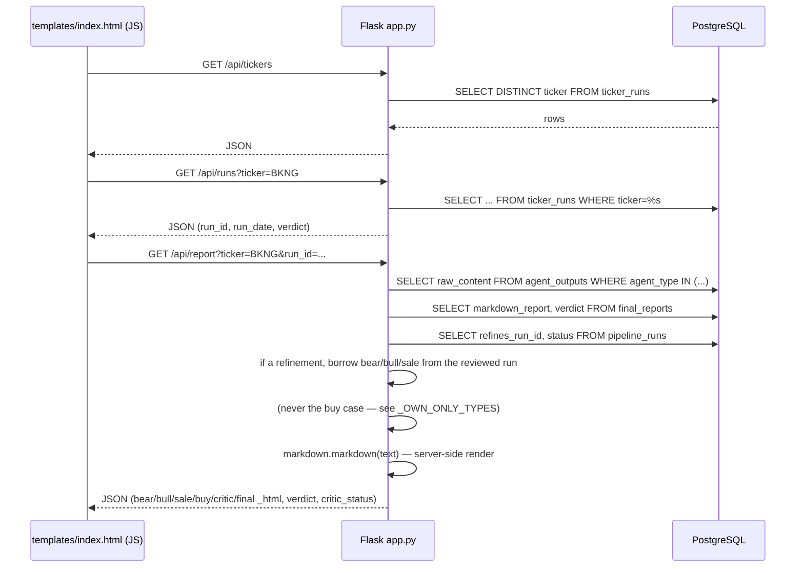

# Web Viewer Walkthrough

Primary files: [`webapp/app.py`](../webapp/app.py) (293 lines, Flask) and
[`webapp/templates/index.html`](../webapp/templates/index.html) (1,234 lines,
vanilla JS — no framework, no build step). Entirely **read-only**: no route
ever runs an `INSERT`/`UPDATE`/`DELETE`. It's a separate process from
`main.py`/`mcp_server.py`, reading its own `webapp/.env` (`DATABASE_URL`,
`PORT`), and connects to the **same** PostgreSQL database the pipeline writes
to — the only thing the two processes share.

## Backend routes, `webapp/app.py`

| Route | Line | Reads | Nature of data / notes |
| :--- | ---: | :--- | :--- |
| `GET /` | `:47` | — | Serves `templates/index.html`. |
| `GET /api/tickers` | `:52` | `ticker_runs` | Distinct tickers, alphabetical; optional `?q=` substring (`ILIKE`). |
| `GET /api/runs?ticker=` | `:78` | `ticker_runs` ⋈ `pipeline_runs` | One ticker's runs, newest first, with `verdict`. The join supplies `refines_run_id`/`critic_status` so a critic refinement is marked **in the picker** — it is the newest run for its ticker, so it is what the picker selects by default and the distinction has to be visible before the click. |
| `GET /api/pipeline-runs` | `:101` | `ticker_runs` (`GROUP BY run_id HAVING COUNT(*) > 1`) | Multi-ticker runs only — single-ticker on-demand runs are excluded here by design (browse those "by ticker" instead). |
| `GET /api/pipeline-run?run_id=` | `:168` | `ticker_runs` | All tickers in one run, ordered Buy→Watch→Avoid then by `magic_rank` (SQL `CASE`, `_VERDICT_ORDER_SQL` at `:137`) — the ordering lives in SQL so the on-screen list and the CSV download can't drift apart. |
| `GET /download-run?run_id=` | `:184` | `ticker_runs` (via `_fetch_run_tickers`, `:147`) | Same rows, same order, as a `.csv` attachment. Carries `SharePriceAtAnalysis` and `PriceAsOf` alongside the verdict and rank. |
| `GET /api/report?ticker=&run_id=` | `:315` | `agent_outputs` (`BEAR_CASE`/`BULL_CASE`/`SALE_CASE`/`BUY_CASE`/`CRITIC_REVIEW`) + `final_reports` + `pipeline_runs` | Raw markdown rendered server-side to HTML (`render_md`, `:41`, via `python-markdown` with `extra`+`sane_lists` extensions) — trusted pipeline output, so no sanitization is applied. Also returns `critic_status` / `critic_rounds` / `source_run_id`. |
| `GET /download?ticker=&run_id=&kind=` | `:338` | same as above | Raw markdown (not HTML) as a `.md` attachment, `kind` ∈ `bear`/`bull`/`sale`/`buy`/`critic`/`final`. |

> **A run can hold more than one row of the same type.** `sale_advisory.py` stores a
> regenerated advisory on the run whose report it was derived from, alongside the one
> that run originally produced. `_fetch_reports`'s `_CASE_TYPES` query therefore
> orders **oldest-first**, so the dict comprehension that follows keeps the *newest*
> of each type — the same rule `db_get_agent_output` and `db_get_sale_case` follow.
> Without the `ORDER BY` the winner was whatever order the planner happened to
> return. See [10-sale-advisory-regeneration.md](10-sale-advisory-regeneration.md).

`_fetch_reports(run_id, ticker)` (`:262`) is the shared helper behind both
`/api/report` and `/download`. It returns a **dict**, not the original 5-tuple —
there are now seven bodies plus two pieces of run metadata, and a positional tuple
that long is a bug waiting to happen at each call site.

### Borrowable vs own-only case documents

`_CASE_TYPES` (`BEAR_CASE`, `BULL_CASE`, `SALE_CASE`) are **borrowed** by a refinement
run from the run it reviewed when it has none of its own — a copy at refine time would
duplicate ~26KB of text and two vectors to say nothing new.

`_OWN_ONLY_TYPES` (`BUY_CASE`) are fetched the same way but **never borrowed**, and
the distinction is load-bearing rather than tidy. A buy case exists only for a `Watch`,
and a critic review can move the verdict off it — `refine.py` then deliberately writes
none. Borrowing the reviewed run's would put an "at what price would I buy this"
document on a run whose verdict is now `Buy` or `Avoid`, which is the one place it must
never appear. Absence here is a decision, not a gap to fill. See
[11-buy-case-and-buy-check.md](11-buy-case-and-buy-check.md).

### The price column, and why the viewer does not fetch it

The per-run decisions list and its CSV both show the **share price the ticker was
analysed at**, read from `ticker_runs.share_price` / `price_as_of`.

Stored rather than fetched live, on purpose. The viewer is read-only, has no FMP
credential, and is meant to stay that way — but more importantly the useful number in
a run listing is what the stock cost **when that verdict was reached**, not what it
costs while you happen to be reading. A live quote in this column would also
contradict the `## Price` section of the report each row links to.

Rows written before the column existed hold NULL and render as `—` with a tooltip
saying so. They cannot be backfilled: the price on that day is gone. A reused report
carries the price of the run it reuses (`db_find_reusable_report` returns it), so the
listing and the served document never disagree.

### Critic refinements in the viewer

A refinement (see [09-critic-and-refinement-loop.md](09-critic-and-refinement-loop.md))
is stored as its own single-ticker run, so it arrives here as an ordinary run with
three differences, all keyed off **`pipeline_runs.refines_run_id IS NOT NULL`** —
the critic loop is the only thing that sets it, so there is no second flag that
could disagree with it:

- **A "Critic Review" tab**, hidden on runs that have none. It stacks *every* round
  oldest-first under `## Review round N`, with each review's own headings demoted one
  level (`_demote_headings`, `:48`) so they nest under their round instead of tying
  with it. This tab is the only place the full exchange is visible: the stored report
  carries the last review only, and only when the critic never agreed.
- **A standing chip** beside the verdict badge — "✓ critic agreed" or "⚠ critic did
  NOT agree", with the round count. It sits *next to* the verdict rather than
  replacing it, because an un-agreed report still has a verdict and the reader needs
  both at once. The outcome comes from `pipeline_runs.status` (`COMPLETED` = agreed).
- **Borrowed Bear/Bull tabs.** A refinement run holds only its own `CRITIC_REVIEW`
  rows, so those tabs would be empty. They are read from the reviewed run via
  `refines_run_id` and stamped "From the reviewed run `<id>`" — borrowed at read time
  rather than copied at refine time, which would duplicate ~26 KB of text and two
  768-dim vectors per refinement to say nothing new, and labelled because the
  refinement never re-ran that research.
- **The Sale Advisory is a different case and gets its own label**
  (`_borrowed_note`, `:60`). Bear/Bull are *inputs* the critic actually read, to
  check the report's summaries against the originals — borrowing them is
  presentational. The advisory is an *output* derived from the pre-review report,
  which the critic never saw: if a revision changed the report, the advisory can be
  describing a thesis that no longer exists, and its sell triggers may be anchored to
  a figure the critic corrected. Since 2026-08 `refine.py` gives each refinement its
  **own** `SALE_CASE` (carried forward when no revision ran, re-derived when one
  did), so this borrowed label now only appears on refinements made before that, or
  when regeneration was disabled or unaffordable — and when it appears it says
  plainly that the advisory predates the review and was not re-derived.

`/api/pipeline-runs` needs no change: it filters to `HAVING COUNT(*) > 1`, and a
refinement is always single-ticker, so refinements never pollute the run browser.

## Frontend, `templates/index.html`

Single-page app, no bundler — plain `<script>` at the bottom of the file
calling `fetch()` against the routes above. Three modes toggled by
`setMode()` (`:583`):

- **`tickerMode`** (`:242`) — ticker `<input>` + `<datalist>` → `loadRuns()`
  (`:446`, `GET /api/runs`) → `loadReport()` (`:478`, `GET /api/report`).
- **`runMode`** (`:257`) — pipeline-run `<select>` → `loadPipelineRuns()`
  (`:509`, `GET /api/pipeline-runs`) → `loadRunDecisions()` (`:535`,
  `GET /api/pipeline-run`) → same `loadReport()` for drill-down, with a
  "Back to run" control (`#backToRun`).
- **`learnMode`** (`:276`) — the lemonade-stand simulator (see below); no
  backend calls at all, purely client-side.

`refreshAll()` (`:595`) is wired to the "⟳ Refresh" button (`#refreshBtn`,
`:238`) and re-runs whichever mode's load function is currently active.

**Two conditional tabs.** `renderCriticStanding()` shows the Critic Review tab only
when the run has reviews, and the Buy Case tab only when it has a `BUY_CASE` — most
runs have neither, and a permanently empty tab reads as a failure rather than as the
correct answer (a `Buy` verdict *should* have no buy case). Neither needs a guard
against being left on a hidden tab: `loadReport()` resets `state.kind` to `final` on
every report load.

### The "Learn the terms" tab

A self-contained financial-literacy simulator — sliders for a lemonade
stand's operating/financial inputs (cups sold, price, COGS, opex, capex,
debt, cash, goodwill, tax rate — `:330-367`) that recompute the income
statement, cash flow, balance sheet, and the Magic Formula ratios live in the
browser (`renderScreen()`, `:979`, and related functions), plus a
tap/hover glossary (`attachGlossaryEvents()`, `:882`; popover DOM at `:374-381`).

**Numeric contract:** the authoritative worked numbers live in
[`webapp/static/learn/lemonade-cheat-sheet.html`](../webapp/static/learn/lemonade-cheat-sheet.html)
(a standalone, downloadable page — not served by any Flask route, just a
static file). The in-app simulator **must** reproduce those figures exactly
at default slider positions — see
[agent_architecture.md §9.D](../src/specs/agent_architecture.md) for the
exact table of expected values (EBIT $120.00, ROC 90.91%, ROA 47.62%, etc.)
and the rule that a new term must be added to the cheat sheet in all three
places it appears there, or the two pages silently disagree.

## Where to look next

- The `ticker_runs`/`agent_outputs`/`final_reports` schema this app reads:
  [03-mcp-tools-and-persistence.md](03-mcp-tools-and-persistence.md) and
  [`sql-schema.sql`](../src/sql-schema.sql).
- Deployment (systemd, port configuration): the root
  [`README.md`](../README.md) and [`webapp/README.md`](../webapp/README.md).
