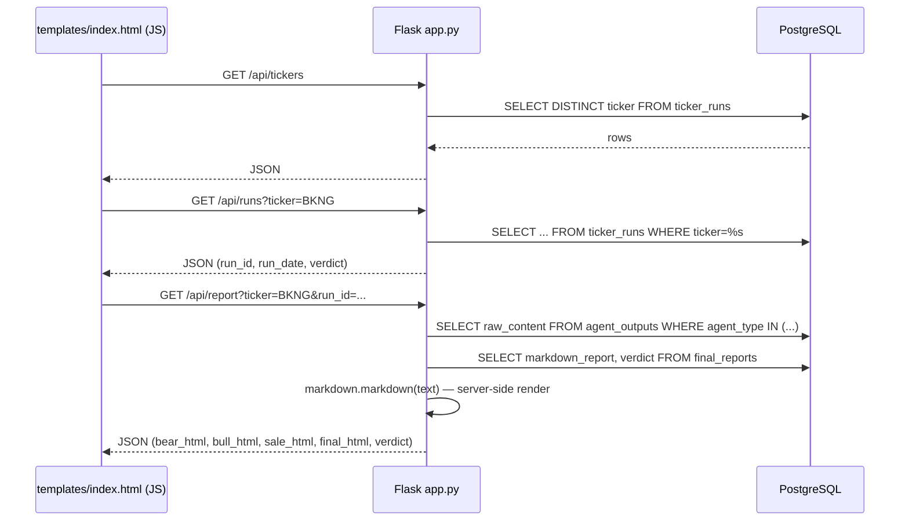

# Web Viewer Walkthrough

Primary files: [`webapp/app.py`](../webapp/app.py) (293 lines, Flask) and
[`webapp/templates/index.html`](../webapp/templates/index.html) (1,234 lines,
vanilla JS — no framework, no build step). Entirely **read-only**: no route
ever runs an `INSERT`/`UPDATE`/`DELETE`. It's a separate process from
`main.py`/`mcp_server.py`, reading its own `webapp/.env` (`DATABASE_URL`,
`PORT`), and connects to the **same** PostgreSQL database the pipeline writes
to — the only thing the two processes share.

## Backend routes, `webapp/app.py`

| Route | Line | Reads | Nature of data / notes |
| :--- | ---: | :--- | :--- |
| `GET /` | `:47` | — | Serves `templates/index.html`. |
| `GET /api/tickers` | `:52` | `ticker_runs` | Distinct tickers, alphabetical; optional `?q=` substring (`ILIKE`). |
| `GET /api/runs?ticker=` | `:77` | `ticker_runs` | One ticker's runs, newest first, with `verdict`. |
| `GET /api/pipeline-runs` | `:101` | `ticker_runs` (`GROUP BY run_id HAVING COUNT(*) > 1`) | Multi-ticker runs only — single-ticker on-demand runs are excluded here by design (browse those "by ticker" instead). |
| `GET /api/pipeline-run?run_id=` | `:168` | `ticker_runs` | All tickers in one run, ordered Buy→Watch→Avoid then by `magic_rank` (SQL `CASE`, `_VERDICT_ORDER_SQL` at `:137`) — the ordering lives in SQL so the on-screen list and the CSV download can't drift apart. |
| `GET /download-run?run_id=` | `:184` | `ticker_runs` (via `_fetch_run_tickers`, `:147`) | Same rows, same order, as a `.csv` attachment. |
| `GET /api/report?ticker=&run_id=` | `:242` | `agent_outputs` (`BEAR_CASE`/`BULL_CASE`/`SALE_CASE`) + `final_reports` | Raw markdown rendered server-side to HTML (`render_md`, `:40`, via `python-markdown` with `extra`+`sane_lists` extensions) — trusted pipeline output, so no sanitization is applied. |
| `GET /download?ticker=&run_id=&kind=` | `:265` | same as above | Raw markdown (not HTML) as a `.md` attachment, `kind` ∈ `bear`/`bull`/`sale`/`final`. |

`_fetch_reports(run_id, ticker)` (`:213`) is the shared helper behind both
`/api/report` and `/download` — one query against `agent_outputs`, one
against `final_reports`.

## Frontend, `templates/index.html`

Single-page app, no bundler — plain `<script>` at the bottom of the file
calling `fetch()` against the routes above. Three modes toggled by
`setMode()` (`:583`):

- **`tickerMode`** (`:242`) — ticker `<input>` + `<datalist>` → `loadRuns()`
  (`:446`, `GET /api/runs`) → `loadReport()` (`:478`, `GET /api/report`).
- **`runMode`** (`:257`) — pipeline-run `<select>` → `loadPipelineRuns()`
  (`:509`, `GET /api/pipeline-runs`) → `loadRunDecisions()` (`:535`,
  `GET /api/pipeline-run`) → same `loadReport()` for drill-down, with a
  "Back to run" control (`#backToRun`).
- **`learnMode`** (`:276`) — the lemonade-stand simulator (see below); no
  backend calls at all, purely client-side.

`refreshAll()` (`:595`) is wired to the "⟳ Refresh" button (`#refreshBtn`,
`:238`) and re-runs whichever mode's load function is currently active.

### The "Learn the terms" tab

A self-contained financial-literacy simulator — sliders for a lemonade
stand's operating/financial inputs (cups sold, price, COGS, opex, capex,
debt, cash, goodwill, tax rate — `:330-367`) that recompute the income
statement, cash flow, balance sheet, and the Magic Formula ratios live in the
browser (`renderScreen()`, `:979`, and related functions), plus a
tap/hover glossary (`attachGlossaryEvents()`, `:882`; popover DOM at `:374-381`).

**Numeric contract:** the authoritative worked numbers live in
[`webapp/static/learn/lemonade-cheat-sheet.html`](../webapp/static/learn/lemonade-cheat-sheet.html)
(a standalone, downloadable page — not served by any Flask route, just a
static file). The in-app simulator **must** reproduce those figures exactly
at default slider positions — see
[agent_architecture.md §9.D](../src/specs/agent_architecture.md) for the
exact table of expected values (EBIT $120.00, ROC 90.91%, ROA 47.62%, etc.)
and the rule that a new term must be added to the cheat sheet in all three
places it appears there, or the two pages silently disagree.

## Where to look next

- The `ticker_runs`/`agent_outputs`/`final_reports` schema this app reads:
  [03-mcp-tools-and-persistence.md](03-mcp-tools-and-persistence.md) and
  [`sql-schema.sql`](../src/sql-schema.sql).
- Deployment (systemd, port configuration): the root
  [`README.md`](../README.md) and [`webapp/README.md`](../webapp/README.md).
