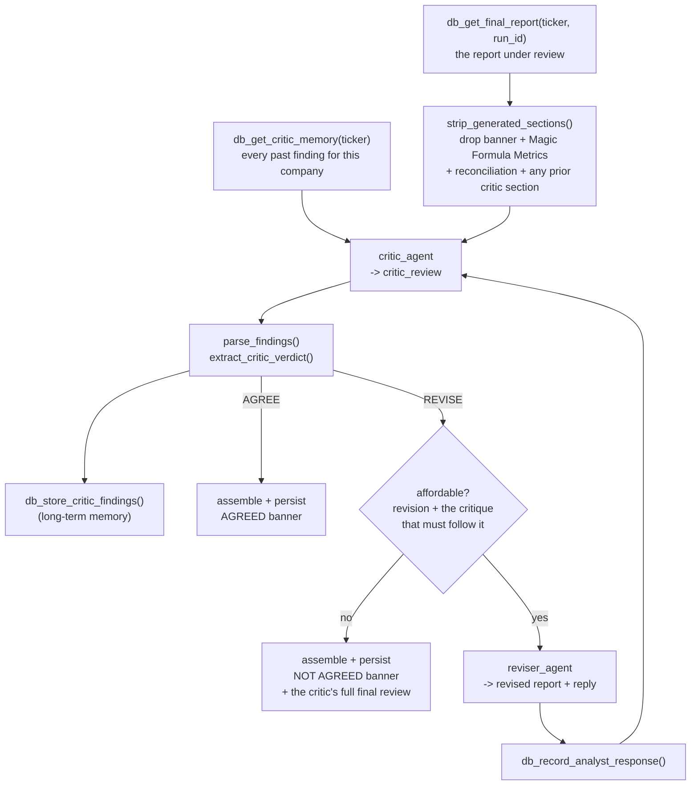

# Critic & Refinement Loop Walkthrough

Primary files: [`src/critic_agent.py`](../src/critic_agent.py) (the two agents and
the parsers), [`src/refine.py`](../src/refine.py) (the loop, the spend control, and
the CLI), [`src/critic-instructions.md`](../src/critic-instructions.md) (the
critic's own prompt).

This is **Phase D** — an opt-in second opinion on a report the pipeline has already
produced. Nothing in Phases A–C calls it, and `main.py` does not import it.

It is the **Producer–Critic pattern** (also called **reflection**, or
generator–evaluator): one agent produces, a second and independent agent evaluates,
and the producer revises against the evaluation until the evaluator is satisfied or
a stopping condition fires. The three things that make or break that pattern in
practice — what "independent" actually means, what makes the evaluator stop, and how
to keep it from relitigating the same point every lap — are §§ below.

## Why it exists

The pipeline already runs an adversarial pair and a neutral judge, but all four
roles read the **same** pre-fetched evidence and descend from the same prompt
lineage, so a fallacy in how that evidence is weighed has nothing outside it to
catch it. The reconciliation gate
([05-guardrails-cost-and-reuse.md](05-guardrails-cost-and-reuse.md) §3) catches
wrong **figures**; nothing catches wrong **reasoning** — a verdict that does not
follow from the report's own body, a Buy resting entirely on a rumoured deal, a
"priced in" assertion with nothing behind it.

The critic is deliberately outside that lineage: its own instruction file written
without reference to the analyst's prompt, its own FMP + Tavily tools so it can
check load-bearing claims against the world rather than against the same cached
blob, and **no sight of the analyst's instruction at all**. A critic told how the
report was supposed to be written grades against that spec instead of against
reality.

## Code map

Two new modules, split the same way `main.py` splits agent definitions from
`_run_pipeline_async`: definitions and pure text handling in one file, orchestration
and money in the other.

### `critic_agent.py` — the agents and the parsers

| Symbol | Line | What it does |
| :--- | ---: | :--- |
| `critic_agent` | `:86` | The `LlmAgent`. `critic-instructions.md` + a per-review block; tools = news/search/profile/metrics/quarterly; `output_key="critic_review"`. |
| `RESPONSE_MARKER` | `:118` | `<<<RESPONSE TO CRITIC>>>` — separates the revised report from the analyst's reply inside one turn. |
| `reviser_agent` | `:120` | The `LlmAgent` built from `main.analyst_agent.instruction` **verbatim** + a revision block; `output_key="revised_report"`. |
| `BLOCKING_SEVERITIES` | `:184` | `("BLOCKING", "MATERIAL")` — the two that prevent agreement. Everything keys off this tuple. |
| `parse_findings` | `:192` | Splits a review into finding dicts (`severity`/`type`/`title`/`finding`). Format-tolerant; see below. |
| `finding_summary` | `:251` | One-line gist for the reader-facing banner — prefers the "Required fix" line over "Why it is wrong". |
| `extract_critic_verdict` | `:269` | Returns `(verdict, note)`. Takes the **stricter** of the declared verdict and the assigned severities. |
| `split_revision` | `:299` | Splits the reviser's turn on `RESPONSE_MARKER` into `(report, reply)`. |
| `format_past_corrections` | `:315` | Renders stored findings into the `PAST_CORRECTIONS` prompt block, truncated. |
| `_run_agent_async` / `run_agent` | `:349` / `:377` | One agent turn in a throwaway session, with 429 backoff. `usage` is built **outside** the retry loop so a rate-limited attempt's tokens are still counted. |

### `refine.py` — the loop, the money, the CLI

| Symbol | Line | What it does |
| :--- | ---: | :--- |
| config constants | `:84-97` | `MAX_BUDGET_USD`, `MAX_ROUNDS`, the two seeds, `ESTIMATE_HEADROOM`, memory bounds — all from `config.yaml`'s `refinement:` block. |
| `CRITIC_SECTION_HEADING` | `:102` | `## Independent Critic Review`. Written by this tool, and stripped before a report re-enters the loop. |
| `strip_generated_sections` | `:108` | Reduces a **stored** report back to the analyst's own prose. |
| `_load_candidate` | `:133` | Recomputes Magic Formula figures via `compute_ticker_magic_metrics` (no LLM, no tokens). |
| `_load_source_case` | `:163` | Loads `BEAR_CASE`/`BULL_CASE` from the reviewed run; missing is survivable, not fatal. |
| `_Estimator` | `:186` | Per-role cost projection for the next round. `observe` `:199`, `full_round` `:205`. |
| `_affordable` | `:217` | Returns a reason string when the next round cannot be paid for, else `""`. |
| `_agreed_banner` / `_not_agreed_banner` | `:233` / `:283` | The reader-facing standing block, including unfixed MINOR findings. |
| `_demote_headings` | `:430` | Pushes an inlined review's headings down so they nest under their container. |
| `_ADVISORY_NOTE` / `_refresh_sale_advisory` | `:310` / `:330` | Gives the refinement its own `SALE_CASE` — carried forward or re-derived. See below. |
| `_assemble` | `:442` | Deterministic sections + analyst prose + reconciliation + critic standing. |
| `run_refinement_loop` | `:460` | **The entry point.** Traced step by step below. |

### Control flow through `run_refinement_loop`

Read it in this order — the four numbered comments in the source mark the same
boundaries:

| Step | Line | What happens |
| :--- | ---: | :--- |
| 1 | `:475` | Load the report under review (`db_get_final_report`). Bail out with an explanatory error if the ticker has none — refinement reviews an existing report, it does not create one. |
| 2 | `:509` | Gather every input, no LLM involved: recomputed candidate, quarterly trends, verified figures, screen context, the two source cases, and `critic_memory` for this ticker. |
| 3 | `:547` | `db_create_pipeline_run(refine_run_id, [ticker], src_run)` — the parent row, carrying `refines_run_id`. |
| — | `:559` | **Pre-flight ceiling check.** If one critique cannot be afforded, stop before spending anything. |
| — | `:568` | `strip_generated_sections` on the stored report → `report_body`, the text that will be critiqued. |
| loop | `:577` | `for rnd in range(1, rounds_allowed + 1)` — the round loop. |
| ↳ a | `:578` | Build this round's `state` dict explicitly (all ten templated keys). |
| ↳ b | `:591` | Run the critic. |
| ↳ c | `:612-613` | `parse_findings` then `extract_critic_verdict` — deterministic Python, never a second model call. |
| ↳ d | `:650` | **AGREE → break.** The loop always ends on a critique. |
| ↳ e | `:656` | Round-limit check, then `:661` the spend check for a revision **plus the critique that must follow it**. |
| ↳ f | `:671` | Run the reviser; `split_revision`; record the reply; `:711` the revised text becomes the new `report_body`. |
| 4a | `:731` | **Sale advisory.** Carried forward if no revision ran, re-derived against the refined report if one did. |
| 4 | `:716` | Assemble and persist: reconciliation gate `:739`, standing banner `:753`, run header `:758`, DB writes, files, `_finalize_run` with the terminal status `:800`. |

## The two agents, `critic_agent.py`

| Agent | Instruction | Tools | `output_key` | Reads (all templated from state) |
| :--- | :--- | :--- | :--- | :--- |
| `critic_agent` | `critic-instructions.md` + a per-review block | `fmp_stock_news`, `web_search_tool`, `fmp_company_profile`, `fmp_metrics_extractor`, `fmp_quarterly_trends` | `critic_review` | `report_under_review`, `bear_data`, `bull_data`, `verified_figures`, `quarterly_data`, `screen_context`, `past_corrections`, `analyst_response` |
| `reviser_agent` | **`main.analyst_agent.instruction` verbatim** + a revision block | *(none)* | `revised_report` | the same, plus `critic_review`, minus `analyst_response` |

`reviser_agent` reusing the analyst's instruction verbatim is the point, not
laziness: a refined report must obey exactly the same rules as a pipeline one —
same five sections, same Buy/Watch/Avoid vocabulary, same basket framing, same
plain-English standard. A second copy of those rules would drift, and the first
symptom would be a refined report subtly different in kind from an unrefined one.

Both use `include_contents="none"`, for the same reason the pipeline agents do
(see [02-agents-and-reasoning-graph.md](02-agents-and-reasoning-graph.md)).

### The response trailer

One agent turn has to carry two things: the rewritten report, and the analyst's
point-by-point reply to the critic. The reply cannot become a sixth report section
— that would leak the argument between two agents into the investor's report — but
the critic must see it, or it re-raises every rejected finding for as many rounds
as the budget allows. So the reviser writes the report, then the marker
`<<<RESPONSE TO CRITIC>>>` (`critic_agent.RESPONSE_MARKER`), then the reply;
`split_revision()` (`critic_agent.py:299`) separates them in Python. A missing marker is tolerated (the
whole turn becomes the report) because losing the reply costs one wasted round,
while rejecting the turn would cost the whole revision.

## The loop, `refine.py:run_refinement_loop`



Per round, in order:

1. **Critique.** `run_agent` (`critic_agent.py:377`) — one throwaway session per turn,
   with 429 backoff. Usage is created outside the retry loop so a rate-limited
   attempt's tokens are still counted.
2. **Parse** (`parse_findings` `critic_agent.py:192`, `extract_critic_verdict` `:269`). Deterministic Python,
   never a second model call — the stopping condition, the spend, and what the
   reader is told all hang off it.
3. **Persist** the critique as a `CRITIC_REVIEW` agent output and its findings as
   `critic_memory` rows.
4. **Stop on AGREE.**
5. **Spend check** (§ below). Stop here if another full round is unaffordable.
6. **Revise**, split off the reply, record the reply against the findings it
   answers, and loop with the revised text as the new report under review.

### Agreement is decided in Python, not by the model

`extract_critic_verdict` (`critic_agent.py:269`) takes the **stricter** of the critic's
declared verdict and the severities it assigned itself:

- Declared `AGREE` while a `BLOCKING`/`MATERIAL` finding stands → forced to
  `REVISE`. Resolving that contradiction the other way would stamp "the critic
  agreed" on a report the critic's own text says is not supportable.
- No parsable `CRITIC VERDICT:` line at all → fall back to the severities. A
  missing line is a formatting failure, never evidence of agreement.
- The **last** match wins, because the instruction quotes `CRITIC VERDICT: AGREE`
  in its own format spec and a model that echoes the spec before answering would
  otherwise have its example read as its answer.

`MINOR` findings never block. A critic that cannot agree over a wording nit spends
the budget and leaves the reader with a report stamped un-agreed for nothing —
`critic-instructions.md` says so in as many words, and this code enforces it.

## Spend control, `refine.py:_Estimator` / `_affordable`

Two ceilings apply: `refinement.max_budget_usd` (or `--max-budget`, $2.25 by
default) for the session, and the existing rolling `budget.per_day_usd` window from
[05](05-guardrails-cost-and-reuse.md) §4 — an ad-hoc command must not route around
the guard that exists to stop exactly this kind of spending.

- **Checked between rounds, never mid-round** (`refine.py:559` pre-flight, `:661` per round). An abandoned round has been billed
  and produces nothing, which is worse than the overspend it prevents. Same rule
  `_check_budget` follows between tickers.
- **A round is priced as revision + the critique that follows it + the sale
  advisory it invalidates** (`_Estimator.full_round`, `refine.py:205`). Shipping a
  revision nobody reviewed would attach the *previous* round's objections to text
  that no longer says what they object to, so the loop always ends on a critique.
  And the moment a revision happens the existing advisory describes a thesis that no
  longer exists, so re-deriving it stops being optional — reserving it here rather
  than discovering the shortfall afterwards is what keeps the ceiling honest. A
  session that agrees first time never pays the reservation, because no revision was
  ever committed to.
- `_Estimator` (`refine.py:186`) keeps **per-role** estimates (the critic makes tool calls, the
  reviser does not), seeded from config and then replaced by what each role
  actually cost × `estimate_headroom`. A zero measurement is ignored — a turn that
  failed before billing is not a cheap round.

Cost is accumulated with `main`'s existing `_new_usage` / `_add_event_usage` /
`_merge_usage` and logged per role per round (`[TICKER critic r2]`,
`[TICKER reviser r2]`), then written to the refinement's own `pipeline_runs` row by
`_finalize_run`. Terminal status is `COMPLETED` (agreed), `BUDGET_EXCEEDED`, or
`NOT_AGREED`.

## Long-term memory, `critic_memory`

The loop's efficiency problem is repetition: a critic re-raising a settled point,
or an analyst reintroducing something it already conceded, spends a paid round
relitigating a lap already run. `critic_memory` (see
[03-mcp-tools-and-persistence.md](03-mcp-tools-and-persistence.md)) is the fix —
one row per finding, replayed into **both** agents' prompts every round via
`format_past_corrections()` (`critic_agent.py:315`), assembled at `refine.py:542`.

- **Retrieved by exact ticker + recency, not by vector similarity.** The retrieval
  key is known exactly (this company's own review history); semantic search would
  return approximate neighbours where an exact answer exists, and would add an
  embedding call per row to a loop whose whole design constraint is cost.
- **Rendered compactly** — the block is sent to both agents on every round, so its
  size multiplies twice over. Each entry keeps date, round, severity, status,
  title, ~600 characters of the finding, and ~400 of the analyst's reply.
- **This session's own findings accumulate in front of the stored ones** and the
  block is re-rendered after every round. Without that, round 2's critic would see
  the analyst's *reply* to round 1 without the findings it answers — it runs with
  `include_contents='none'` and has no memory of its own previous turn, so it would
  be reading "1. FIXED — removed the rumoured partnership" with no idea what was
  rumoured, unable to confirm the fix or fill in `## Prior Findings Status`.
- **No foreign key onto `pipeline_runs`**, unlike every other table. The others are
  per-run artefacts that should cascade away with their run; this is memory, and
  memory that vanished with the run it was learned from would let the same fallacy
  return on the next refinement and be paid for again.
- Rows are `OPEN` while the session runs, settled to `RESOLVED` (critic agreed) or
  `UNRESOLVED` (ceiling hit with objections standing) at the end. A session killed
  mid-flight leaves `OPEN` rows, which read correctly as "never settled".

## The sale advisory after a review

The advisory is an **output** of the report, not an input to it: the sale advisor
reads the finished report and names the events that would break its thesis. **The
critic never sees it.** So a review that changes the report silently leaves the
advisory describing a thesis that no longer exists — and since every sell trigger
must be anchored to `VERIFIED_FIGURES` with the current value quoted beside it, a
figure the critic corrected can leave a threshold calibrated against a number the
pipeline itself now says was wrong.

`_refresh_sale_advisory` (`refine.py:330`) handles it by outcome, so the cost is only
paid when it buys something:

| Outcome | What happens | Cost |
| :--- | :--- | ---: |
| Critic agreed, **no revision ran** | The analyst's prose is byte-identical to what the advisory was built from, so it is exactly as valid as before. Carried forward into the refinement run, stamped "carried over … unchanged". | $0 |
| **A revision ran** | Re-derived by running `main.sale_advisor_agent` against the revised report, stamped "re-derived after independent critic review". | ~$0.07–0.10 |
| A revision ran but the ceiling won't cover it | Defensive only — see below. The previous advisory is carried with a **visible staleness warning**. Shipping it silently would be the worst of the three. | $0 |

**The third row should never happen.** `_Estimator.full_round` reserves the advisory
before the loop commits to the revision that would make it stale, so the money is
already set aside by construction. Reaching that branch means either the advisory
cost materially more than its $0.12 seed (measured range $0.072–$0.095) or the
rolling daily ceiling moved underneath a running session — both real conditions
worth knowing about, neither worth papering over, which is why the branch survives
and logs loudly rather than being replaced by an assertion.

If that branch ever does fire, the repair is one command:
`python sale_advisory.py TICKER --run <refinement_run_id>` — see
[10-sale-advisory-regeneration.md](10-sale-advisory-regeneration.md). Note that
re-running `refine.py` would **not** repair it: the critic would agree immediately
(the report is already corrected), so no revision would run, and the "no revision →
carry forward" rule would carry the stale advisory forward again, this time without
its warning label.

Why reserve rather than give the advisory its own budget: a second pot would mean
the ceiling you name being quietly exceeded by the advisory's ~$0.12, and a
ceiling that can be exceeded by design is not a ceiling. The reservation buys the same guarantee with one honest
number.

Three deliberate choices:

- **The advisory is not itself critiqued.** It has its own guardrails (figure
  anchoring, the seasonality rule), and reviewing it would roughly double the loop's
  cost for a second-order artefact.
- **It is regenerated even when the loop ended un-agreed**, as long as a revision
  ran — the report being shipped is the revised one either way.
- **The banner quotes `review_cost`, captured before this step** (`refine.py:725`),
  so "…of review cost" means the review. `_finalize_run` still records the true
  session total.

### The bug this fixed

`_with_run_header` stamps the refinement's `run_id` on the refined report, and its
docstring tells the reader that is the id to save against their lot so
`--sell-check --run RUN_ID` can pin the exact thesis they bought under. But a
refinement wrote **no `SALE_CASE`**, so that command failed outright:

```
No SALE_CASE found for CRMD in run 202aac5e-…. Run the analysis pipeline first.
```

Carrying the advisory forward is what makes the id the report hands you actually
usable. Unpinned `--sell-check` also silently resolved to the pre-critique
conditions; it now finds the refinement's own.

Set `refinement.regenerate_sale_advisory: false` to restore the old behaviour.

## What the reader gets

The refined report is assembled the same way `analyze_ticker` assembles a fresh
one — deterministic `## Magic Formula Metrics`, the analyst's prose, reconciliation
warnings — plus one section the pipeline never writes:

- **Agreed** (`_agreed_banner`, `refine.py:233`)**:** a short `## Independent Critic Review` note giving the round count
  and review cost, and stating plainly that agreement means neither agent could
  find a fault in the argument, **not** that the call is right.
- **Not agreed** (`_not_agreed_banner`, `refine.py:283`)**:** the same heading carrying a blunt "**The independent critic has
  NOT agreed this report**", the count of blocking and material objections still
  standing, the stopping reason, and **the critic's full final review reproduced
  underneath**.

Files: `reports/{TICKER}_Refined_Report_{Verdict}.md` and
`reports/{TICKER}_Critic_Review.md`. The original run's report and rows are left
untouched — the refinement gets its own `run_id`, its own `pipeline_runs` cost row,
and its own `final_reports` row, so it appears in the web UI as its own
single-ticker run and the history of what was concluded when stays intact.

`pipeline_runs.refines_run_id` names the run that was reviewed. It is set only here,
so a non-NULL value **is** the test for "this run is a refinement" — there is no
separate flag that could fall out of sync — and paired with `status` it also carries
the outcome (`COMPLETED` = the critic agreed). The web UI keys everything off those
two columns: a Critic Review tab, a standing chip beside the verdict, a marker in the
run picker, and borrowing the Bear/Bull/Sale tabs from the reviewed run rather than
copying them. See [06-webapp.md](06-webapp.md).

`analysis_key` is stored empty on purpose: a refined report must never be served by
the pipeline's duplicate-run skip in place of a fresh analysis. Its provenance is a
review session, not a filing, and reuse keys on filings.

## Why a hand-written loop rather than ADK's `LoopAgent`

`LoopAgent` runs sub-agents until `max_iterations` or an escalation event, and it
would work — at a cost.

- **The stopping condition is a spend decision, not an agent decision.** It needs
  the running dollar total and a projection of the next round, both of which live
  in `main`'s cost accounting, outside any agent's context. A `LoopAgent` would
  need an escalation callback reaching into the same accounting anyway.
- **Cost must be attributed per role per round**, exactly as `_run_pipeline_async`
  attributes it per role per ticker, or a prompt change that doubles the critic's
  cost is invisible inside a moving loop total.
- **The hand-off is a rewrite, not an append** — each revision *replaces* the
  report under review.
- `main.py` already rejected `SequentialAgent` for the neighbouring reason
  (per-agent 429 retry, [01](01-orchestration-and-cli.md) §3). Two orchestration
  idioms in one codebase would be worse than one.

## Measured behaviour, first three live runs (2026-08-01, gemini-3.6-flash)

| Ticker | Source verdict | Rounds | Outcome | Cost | What the critic found |
| :--- | :--- | ---: | :--- | ---: | :--- |
| HRB | Buy | 1 | AGREE | $0.1248 | 1 MINOR — Q3 net income growth of +17.4% was inflated by an $84.1M one-off IRS settlement benefit (operating income grew 7.0%). Found by search; **not visible in any feed the pipeline gives its agents**, since `fmp_quarterly_trends` returns the figures, not the 10-Q narrative explaining them. |
| LLY | Watch | 1 | AGREE | $0.0959 | 1 MINOR — "What Would Make This Wrong" named no specific quarter to check (checklist item 19). |
| FISV | Watch | 2 | AGREE after one revision | $0.2556 | 1 BLOCKING + 1 MATERIAL + 2 MINOR (below). |

The FISV case is the useful one. Its report was written on 24 July, under prompts
that **predate** the `Fix analyst rubber-stamping, peer mislabelling, and seasonality
blindness` commit — and the critic independently rediscovered two of the exact
failures those prompt patches were written to prevent:

- **BLOCKING — return-on-capital conflation.** The report cited the Magic Formula
  ROC of 136.73% alone. Goodwill is 59.1% of Fiserv's total assets; the
  goodwill-inclusive figure is **9.4%**, a 14x gap. This is §2.F of
  [`agent_architecture.md`](../src/specs/agent_architecture.md), found from the report
  text without being told to look for it.
- **MATERIAL** — market cap and P/E contradicted `VERIFIED_FIGURES`.
- **MINOR** — misstated Q1 quarterly deltas; missing basket framing (§2.G).

The reviser fixed all four (including the two MINORs it was not required to address),
replied `1. FIXED — … 2. FIXED — …`, and round 2 returned AGREE with zero findings.
The verdict stayed Watch throughout: the defects were in the reasoning quality, not
the conclusion.

Two things this validates that the offline tests cannot: the critic finds real
defects it was not pointed at, and the severity scale is used honestly — three of the
five rounds ended in agreement with a MINOR outstanding rather than being inflated
into a paid revision.

One thing it does **not** yet validate: no session has hit the budget or round
ceiling with objections standing, so the un-agreed report path has only ever been
exercised with stubbed agents.

## Tests

[`src/test_critic.py`](../src/test_critic.py) — 52 offline cases, no model calls,
no database. It covers the two failures that actually matter: a critique the parser
reads as clean when it is not (which would stamp agreement on a blocking
objection), and a spend projection that lets the loop start a round it cannot
finish. Also covers format drift in the critic's output, the response-marker split,
section stripping (including refining an already-refined report), the reader-facing
banners, and memory truncation.

```bash
cd src && python test_critic.py
```

## Where to look next

- The analyst whose instruction the reviser inherits:
  [02-agents-and-reasoning-graph.md](02-agents-and-reasoning-graph.md).
- The cost accounting and budget machinery this reuses:
  [05-guardrails-cost-and-reuse.md](05-guardrails-cost-and-reuse.md).
- The `db_*` tools it calls:
  [03-mcp-tools-and-persistence.md](03-mcp-tools-and-persistence.md).
