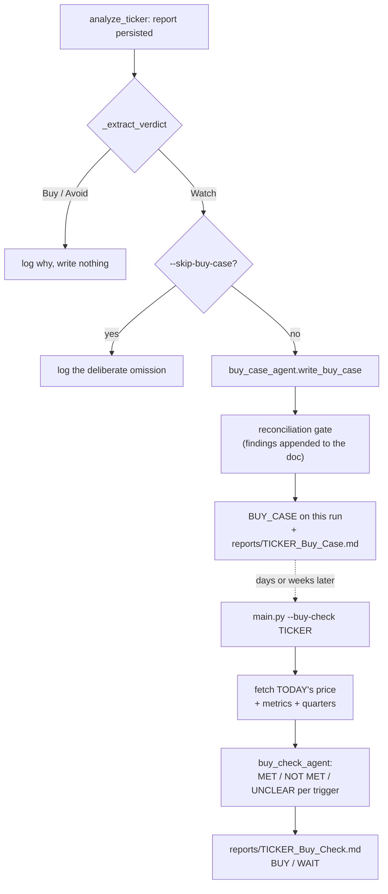

# Phase E — the Buy Case, and the Buy-Condition Check

Primary files: [`src/buy_case_agent.py`](../src/buy_case_agent.py) (both agents and
the shared write path), [`src/buy_case.py`](../src/buy_case.py) (the standalone
command), [`src/buy-case-instructions.md`](../src/buy-case-instructions.md) and
[`src/buy-check-instructions.md`](../src/buy-check-instructions.md). Wired into the
pipeline at [`src/main.py`](../src/main.py) (`analyze_ticker`, `run_buy_check`) and
into the critic loop at [`src/refine.py`](../src/refine.py) (`_refresh_buy_case`).

A `Watch` verdict says "not at this price, not on this evidence, not today" and then
stops. Phase E finishes the sentence: **the price range and the observable events at
which this particular Watch becomes a Buy**, written precisely enough that a later
command can check each one and answer yes or no without re-reading the argument.

It is the mirror of Phase C. The sale advisory assumes the stock is owned and names
what would break the thesis; the buy case assumes it is not owned and names what would
make it worth owning.

## The three entry points, and the one function they share

| Caller | When | Which run the artefact lands on |
| :--- | :--- | :--- |
| `main.analyze_ticker` | in the pipeline, right after the report is stored, if the verdict is `Watch` | the pipeline run |
| `refine._refresh_buy_case` | after a critic review whose refined report is a `Watch` | the refinement run |
| `buy_case.generate_buy_case` | on demand, for any stored `Watch` report | the run named by `--run` (artefact), with a separate row for the cost |

All three go through `buy_case_agent.write_buy_case`, which runs the agent, logs and
merges the cost, runs the reconciliation gate, stamps the run banner and any
provenance note, writes the `BUY_CASE` row and the `.md` file. The callers differ only
in *which run* and *what note* — everything between is identical by construction
rather than by three authors remembering to keep it so.

`run_buy_case` under it is the pure generator, shared for the same reason
`run_sale_advisor` is: two copies would drift the moment the agent gains a templated
key, and the symptom would be one entry point quietly producing a worse document.

## Why it runs after the graph, not in it

`sale_advisor_agent` is a member of `PIPELINE_AGENTS` because it applies to every
verdict. The buy case is conditional on a verdict that does not exist until
`_extract_verdict` has read the analyst's finished prose — a Python decision taken
after the graph has finished. Putting a conditional edge in the graph would mean the
graph knowing about verdict parsing; running it as a post-step keeps that in one
place.

Two consequences worth knowing:

- The report is **already persisted** when Phase E starts, so a failure here costs the
  buy case and nothing else.
- `main.py` cannot import `buy_case_agent` at module scope — that module imports
  `main` for the shared cost/logging plumbing, as `critic_agent` does. The import is
  deferred into `analyze_ticker` and `run_buy_check`, and `main.py` opens with
  `sys.modules.setdefault("main", sys.modules[__name__])` so that `import main` from
  inside resolves back to the running module. Without that line, `python main.py`
  would execute `main.py` a second time under a second name: a second config read, a
  second set of agents, and a second pair of log handlers on the same logger — every
  log line twice, split across two files.

## The Watch gate

`buy_case_agent.is_watch(verdict)` is the only place the rule lives, and it is used by
all three callers. It fails **closed**: anything unrecognisable is treated as
not-a-Watch. The asymmetry is intentional — a missing buy case is a gap `buy_case.py`
repairs on demand, while a buy case attached to an `Avoid` is a defect that has
already been published.

`buy_case.py` refuses on a non-Watch report in the same words, and there is
deliberately no override flag. If the verdict looks wrong, the answer is
[`refine.py`](09-critic-and-refinement-loop.md) — let the critic move it on the
evidence — not a set of entry conditions written underneath a verdict that says no.

## The forward-looking feeds (`mcp_server.py`, "TOOL 5")

Everything else in the system is backward-looking. Five tools exist for the forward
question and are given **only** to these two agents — see
[03-mcp-tools-and-persistence.md](03-mcp-tools-and-persistence.md) for the field-level
detail:

`fmp_price_snapshot` · `fmp_forward_estimates` · `fmp_earnings_calendar` ·
`fmp_revenue_segments` · `fmp_pending_ma_filings`

The rule they protect: **projections stay out of the verdict.** The analyst's
instruction forbids resting a `Buy` on a speculative catalyst, so giving the
bear/bull/analyst chain analyst estimates would undercut a constraint the pipeline
depends on. Phase E sits downstream of the verdict, so it can use them — and it
carries the same discipline in its own vocabulary (CONFIRMED vs SPECULATIVE; a trigger
may reference a speculative event only in the form of its *confirmation*).

`fmp_forward_estimates` returns analyst counts and the low/high spread alongside every
consensus figure, and flags thin coverage (≤2 analysts) or a wide spread (high/low ≥
1.5x) in the payload itself. The instructions require the prose to repeat the flag: a
forward P/E with no analyst count is a number wearing a disguise.

## PRICE_DATA: fetched, not asked for, and shared

`price_data_block(ticker, data=None)` renders the current quote as labelled text and
seeds it into the prompt, even though `fmp_price_snapshot` is also in the toolbelt.
The pipeline passes the snapshot it already fetched (`main._price_snapshot`), so the
price the buy triggers are measured against is byte-identical to the one printed in
the report's `## Price` section — two quotes taken a minute apart would be a real
discrepancy in a document whose entire first trigger is a price threshold. Omitting
the argument fetches one; passing an empty dict means "fetched, and there was none". Same
reasoning as `verified_figures` in Phase B: the number the whole document turns on
must not depend on a tool call the model might skip, or make once and then paraphrase
from memory three sections later. `--buy-check` seeds it the same way, and its
instructions say explicitly that PRICE_DATA — not any price quoted inside the stored
buy case — is the authority for the price trigger.

When the quote is unavailable the block says so and tells the agent what to do about
it (express Trigger 1 against a valuation multiple, quote no price as current) rather
than silently omitting the section.

## The output contract, and what makes it checkable

Seven fixed sections; section 5 is the one that gets tested later. The rules that earn
it that status:

1. **The price trigger is first, mandatory, and derived** — the arithmetic is shown.
   "Below $141.75, which is 35x the $4.05 FY2027 consensus" can be argued with; "below
   $141.75" cannot.
2. **Every threshold prints the current actual value beside it**, so the distance is
   visible and a trigger already satisfied by today's figures is rejected rather than
   written.
3. **Every numeric threshold is anchored** to `verified_figures`, `quarterly_data`, or
   the forward estimates — the Phase C anchoring rule, for the Phase C reason: a
   threshold calibrated off a wrong baseline silently cannot fire.
4. **Quarterly triggers compare like with like** and are tested against the eight
   quarters supplied, so a seasonal business does not fire one every year.
5. **Every trigger carries a date or a named event**, so it can be declared failed.
6. **The document says how many must fire.** `--buy-check` applies that rule; where it
   is missing the checker falls back to "price plus at least one event trigger" and
   says that it is doing so.

`count_triggers` is a **log figure, not a gate** — deliberately. The machine-readable
half of this design is "a later LLM re-reads the document", not "a parser must accept
it", which is what lets the advisor write for a human without a format police. The
first live run demonstrated the point by writing `### Trigger 1 — Price` headings
instead of the bolded list the instructions ask for; the counter reported zero and
nothing else cared.

## `--buy-check`, and why its default differs from `--sell-check`'s

| | `--sell-check` | `--buy-check` |
| :--- | :--- | :--- |
| Reader | owns the stock | does not own it |
| Question | has the thesis I bought under broken? | has this become worth buying? |
| Correct anchor | the run **purchased under** | **today** |
| Default | most recent; `--run` corrects it for a re-analysed holding | most recent, which is already right; `--run` tests a *particular* past case |

Both are lightweight: they read stored conditions, write one `.md`, and create no
`pipeline_runs`/`ticker_runs` rows, so neither appears in the web UI's run lists.

`run_buy_check` also loads the ticker's latest report and **warns** when its verdict
has moved off `Watch` — the conditions being tested may belong to a reading of the
company the pipeline has since revised. It warns rather than refusing: the operator
asked for those conditions to be checked, and the newer verdict is information.

## After a critic review (`refine._refresh_buy_case`)

Four outcomes, not two, because a review can create *or* destroy the need for a buy
case:

| Refined verdict | Reviewed run had one | Outcome |
| :--- | :--- | :--- |
| not `Watch` | either | `none` — nothing written; the reviewed run keeps its own |
| `Watch` | no | `created` — the review moved the verdict onto Watch, or repaired a `--skip-buy-case` gap |
| `Watch` | yes, revision ran | `regenerated` against the revised text and today's price |
| `Watch` | yes, no revision | `carried` forward unchanged, for $0 |

Carrying forward is not tidiness: the refined report stamps the refinement's `run_id`
and tells the reader to record it, so a refinement that left no `BUY_CASE` under its
own id would make `--buy-check --run <that id>` fail outright — the same bug the sale
advisory had before 2026-08.

The money is reserved in `_Estimator.full_round` before the loop commits to a
revision. It has to be reserved **unconditionally**, because whether it will be needed
depends on the verdict of a report that does not exist yet; `refinement.max_budget_usd`
was raised 2.25 → 2.45 to absorb it, so the reservation does not quietly buy fewer
review rounds. A session ending on `Buy` or `Avoid` simply does not spend it.

The full decision table is covered offline by
[`src/test_buy_case.py`](../src/test_buy_case.py), including the two budget-exhausted
paths (carry with a visible staleness label; or, with nothing to carry, end honestly
with no buy case).

## Cost, and where it lands

| Path | Typical cost | Whose run totals it joins |
| :--- | :--- | :--- |
| In-pipeline (per `Watch` ticker) | ~$0.13–0.18 | the pipeline run's — merged into the accumulator `analyze_ticker` returns |
| After a refinement | same | the refinement run's |
| `buy_case.py` | same | **its own** `pipeline_runs` row; the target run's totals are never rewritten |
| `--buy-check` | ~$0.08 | none — it creates no run row, and is logged only |

Measured on the first live run (MRVL, 2026-08-02, gemini-3.6-flash): buy case $0.1349
(4 calls, 68.9k tokens, 24.4k cached), buy-check $0.0779 (2 calls).

The standalone command's split — artefact on the target run, cost on its own — is
exactly `sale_advisory.py`'s, and for the same reasons, which
[10-sale-advisory-regeneration.md](10-sale-advisory-regeneration.md) sets out in full.

## The webapp

`BUY_CASE` is in `_OWN_ONLY_TYPES`, not `_CASE_TYPES` — fetched like the other case
documents but **never borrowed** by a refinement run from the run it reviewed. Bear,
Bull and Sale are borrowed when a refinement has none of its own; a buy case must not
be, because `refine.py` deliberately writes none when the verdict has moved off
`Watch`, and borrowing would then put an "at what price would I buy this" document on
a run whose verdict is `Buy` or `Avoid`. Absence here is a decision, not a gap.

The tab is hidden unless the run actually has one, like the Critic Review tab.

## Where to look next

- The Phase C sale advisory this mirrors: [02-agents-and-reasoning-graph.md](02-agents-and-reasoning-graph.md).
- The standalone-command pattern it copies: [10-sale-advisory-regeneration.md](10-sale-advisory-regeneration.md).
- The critic loop that regenerates it: [09-critic-and-refinement-loop.md](09-critic-and-refinement-loop.md).
- The tools it reads: [03-mcp-tools-and-persistence.md](03-mcp-tools-and-persistence.md).
- The design rationale, with the phase-letter map: `specs/agent_architecture.md` §12.
