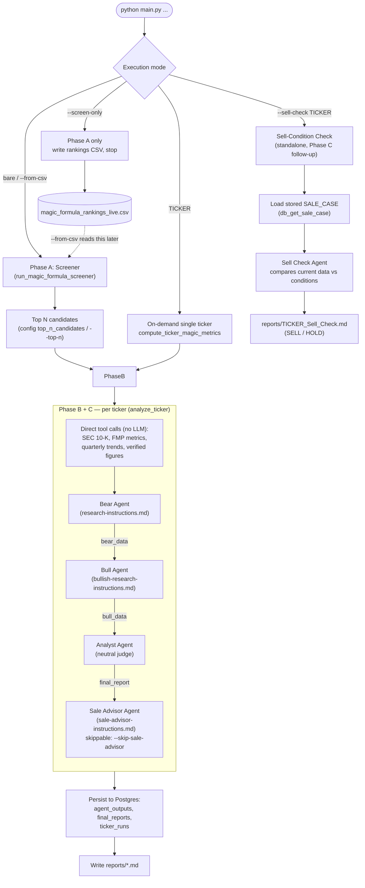
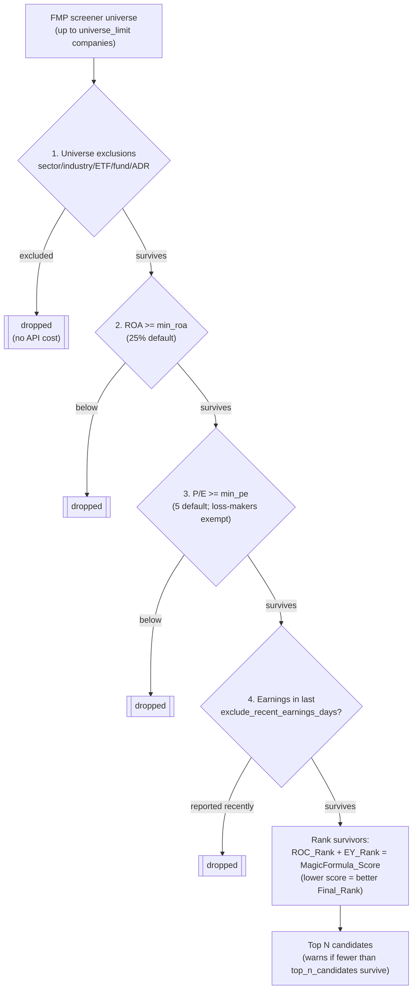
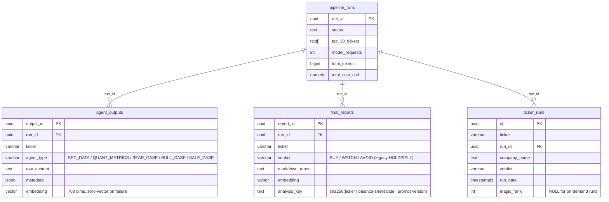
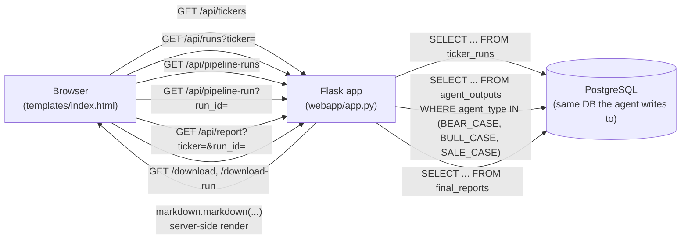

# ADK Agent System Technical Architecture & Implementation Guide

This specification guides the Coding Agent in implementing a multi-agent investment workflow using **Google ADK (Agent Development Kit)**, **Model Context Protocol (MCP)** tools, and **Python**.

---

## 1. System Overview & Sequence Workflow

The application supports five execution modes (see §8.A for the full list —
full pipeline, screen-only, from-CSV, on-demand single-ticker, and sell-check):

- **Full pipeline run** — Phase A screener feeds the Top N candidates into Phase B/C.
- **Screen-only run** — Phase A alone; refreshes the rankings CSV and stops (no cost).
- **CSV run** — skips Phase A, reusing a previous rankings CSV, then runs Phase B/C.
- **On-demand single-ticker run** — Phase B/C runs directly on one user-supplied
  ticker, bypassing Phase A. It is still recorded as its own `pipeline_runs`
  entry (containing just that one ticker) for full traceability.
- **Sell-condition check** — a Phase C follow-up for a single already-owned
  ticker; does not create a `pipeline_runs` row.

The application executes up to a 4-stage workflow (screening, then three
per-ticker phases) managed by `main.py`'s orchestration functions (there is no
single top-level "Orchestrator Agent" object — `run_orchestrator`,
`run_from_csv`, `run_single_ticker`, etc. each drive the same shared
`analyze_ticker` per-ticker logic; see §8):



1. **Phase A: Magic Formula Screening**
   - **Agent:** `MagicFormulaScreenerAgent`
   - **Action:** Triggers the MCP Tool wrapping `magic_formula_starter_screener.py`.
   - **Eligibility gates** (Greenblatt's step-by-step screen — see §2.H): drop financials, utilities, funds/REITs and foreign issuers (ADRs); drop **ROA below 25%**; drop **P/E below 5**; drop anything that **announced earnings in the last 7 days**.
   - **Output:** Ranks the survivors on the Magic Formula itself (ROC + Earnings Yield), extracting exactly the **Top 30 ranked companies**.
2. **Phase B: Balanced Decomposer Analysis** (per ticker)

   **Data gathering — direct tool calls (no LLM):**
   - **SEC 10-K** (`fetch_sec_10k_data`, `edgar-tools`): Item 1 business/segment data and **>10% customer concentration notes**.
   - **FMP metrics** (`fmp_metrics_extractor`): 3-year trailing metrics, 5-year P/E average, competitor metrics, analyst consensus targets. **These are ANNUAL periods** and describe multi-year trend only — they cannot show recent deterioration.
   - **FMP quarterly trends** (`fmp_quarterly_trends`): the last **8 quarters** of income statement, cash flow, and balance sheet, plus an explicit **year-over-year comparison of each recent quarter against the same quarter one year earlier** (Q vs Q−4, so seasonality is already aligned). See §2.D for why this is a separate, mandatory feed.
   - **Magic Formula value/quality signal** (`screen_context`): ROC + Earnings Yield + rank. For on-demand single tickers (where the screener didn't run), `compute_ticker_magic_metrics` computes ROC/EY on the fly.
   - **Verified figures** (`verified_figures`): the deterministic balance-sheet ground truth — total debt, cash, market cap, enterprise value, equity, total assets, goodwill/intangibles, EBIT — plus the goodwill-inclusive ROIC companion to ROC. See §2.E.

   These are gathered once and seeded into session state (`sec_data`, `metrics_data`, `quarterly_data`, `verified_figures`, `screen_context`) for the three reasoning agents below.

   **Reasoning — three roles run in sequence over one shared session (bear, then bull, then the neutral judge):** implemented as a plain ordered list of `LlmAgent`s run one after another against the same ADK session (`output_key` handoff), not ADK's `SequentialAgent` class — see §5B "Per-agent retry" for why: it lets a mid-graph 429 retry only the role that failed instead of re-running (and re-paying for) every role before it.
   - **Agent 1: Bear Agent** — instruction = `research-instructions.md` (skeptical). Uses `fmp_stock_news` + `web_search_tool` (Tavily, bear queries) plus the SEC/metrics data to build the **bear case** → `state['bear_data']`.
   - **Agent 2: Bull Agent** — instruction = `bullish-research-instructions.md`. Runs **after** the bear agent (its Section 4 directly refutes the bear case). Uses `fmp_stock_news` + `web_search_tool` (Tavily, bull queries) plus SEC/metrics/`screen_context` to build the **bull case** → `state['bull_data']`.
   - **Agent 3: Analyst Agent (Neutral Judge)** — carries **no** skeptical prompt. Weighs `bear_data` vs `bull_data` (plus `screen_context`, `quarterly_data`, `verified_figures`) and emits a combined Markdown report with `## Recent Quarter Check`, `## Bull Case`, `## Bear Case`, `## Final Verdict`, and `## What Would Make This Wrong` sections.
        - **Recent Quarter Check (written first):** reports what the most recent quarter did year-over-year and states whether it **confirms or contradicts** the longer-term picture the two cases argue over. The verdict may not be reached without addressing a contradiction.
        - **Verdict:** exactly one of `Buy` / `Watch` / `Avoid`, written for an investor who does **not** currently own the stock (Buy = passes the screen on its own merits; Watch = not compelling now / watchlist; Avoid = actively unattractive), with a one-paragraph justification of how the two cases net out.
        - **Verdict is a basket judgement, not a stock tip.** See §2.G — the verdict line must carry the screen-pass qualifier and the report must tell the reader the strategy depends on holding many such names.
        - **Evidence weighting:** realised results outrank projections; bull catalysts must be labelled CONFIRMED or SPECULATIVE; **a `Buy` may not rest on a SPECULATIVE catalyst** (if removing every speculative catalyst collapses the bull case, the verdict is at best `Watch`); "priced in" must be substantiated or dropped.
        - **What Would Make This Wrong:** every report, whatever the verdict, names the single most likely way it is wrong as a specific observable development, and what a reader would see in a future earnings report if it were happening.
        - **Balance:** skepticism lives in the Bear Agent, balanced by an equal Bull Agent; the judge itself is neutral. This removes the structural bear bias. The anti-over-caution guidance in the verdict stance is paired with an equal anti-optimism constraint — the two failure directions are symmetric and both are guarded.
        - **Output:** written to `reports/{Ticker}_Skeptical_Analysis.md`; `bear_data`/`bull_data` are also persisted separately as `agent_outputs` (BEAR_CASE / BULL_CASE) for drill-down.

   **Handoff sequence.** Each role runs as its own `Runner` call over the same
   ADK session, so a rate-limit retry only re-runs the role that failed (see
   §5B). The `output_key` on each `LlmAgent` writes into shared session state,
   which the next agent's instruction template reads:

   ```mermaid
   sequenceDiagram
       participant O as analyze_ticker
       participant S as Shared ADK session
       participant Bear as Bear Agent
       participant Bull as Bull Agent
       participant Judge as Analyst Agent
       participant Sale as Sale Advisor Agent

       O->>S: seed ticker, company_name, sec_data,<br/>metrics_data, quarterly_data,<br/>verified_figures, screen_context
       O->>Bear: run (reads sec_data/metrics_data/screen_context)
       Bear->>Bear: fmp_stock_news + web_search_tool (bear framing)
       Bear->>S: write bear_data
       O->>Bull: run (reads bear_data + sec_data/metrics_data/screen_context)
       Bull->>Bull: fmp_stock_news + web_search_tool (bull framing)
       Bull->>S: write bull_data
       O->>Judge: run (reads bear_data + bull_data + verified_figures)
       Judge->>S: write final_report (verdict: Buy/Watch/Avoid)
       alt not --skip-sale-advisor
           O->>Sale: run (reads final_report + verified_figures)
           Sale->>Sale: fmp_stock_news + web_search_tool (adverse events)
           Sale->>S: write sale_data
       end
       O->>S: read final state (bear_data, bull_data,<br/>final_report, sale_data)
       O->>O: reconciliation gate + persist to Postgres
   ```

   **Post-generation — reconciliation gate (no LLM):** after the graph completes, every agent-written section is checked against `verified_figures`; contradictions are logged and surfaced in the report. See §2.E.

3. **Phase C: Sale Advisory** (per ticker)
   **Sale advisor - a agent that finds advserse business events:**
   - **Agent: Sale Advisor agent**: - instruction = `sale-advisor-instructions.md`. Uses `fmp_stock_news` + `web_search_tool` (Tavily)
   - **Thresholds must be anchored.** Every numeric sell trigger has to be derived from `verified_figures` or `quarterly_data`, and the report must print the **current actual value beside each threshold** ("total debt above $32B — currently $29.3B"). A trigger calibrated off a wrong baseline is worse than no trigger: it silently cannot fire. This is not hypothetical — see §2.E.

4. **Sell-Condition Check** (on-demand, single stock — Phase C follow-up)
   **Sell-condition evaluator - tests whether the prior sale conditions are now met:**
   - **Agent: Sell Check agent** — no instruction file; carries a self-contained prompt. Loads a stored `SALE_CASE` via `db_get_sale_case(ticker, run_id)` (a **specific run's** conditions when a run is pinned, otherwise the **most recent**), gathers **current** FMP metrics (`fmp_metrics_extractor`) **and quarterly trends (`fmp_quarterly_trends`)** by direct call, plus live `fmp_stock_news` + `web_search_tool` research, then marks each sale condition **MET / NOT MET / UNCLEAR** with sourced evidence and emits a `## Sell Recommendation` (`SELL` if **any** condition is clearly met, else `HOLD`).
   - Sale conditions are routinely written in quarterly terms ("two consecutive quarters of negative growth"), which annual metrics cannot answer either way — hence the quarterly feed here as well as in Phase B.
   - Runs standalone for one ticker (not in the analysis graph). It is a lightweight flow: it reads the prior conditions and writes `reports/{Ticker}_Sell_Check.md`, but does **not** create a `pipeline_runs`/`ticker_runs` record, so it never appears in the web UI's run lists.
---

## 2. MCP Tools & Analytical Guardrails

The coding agent **must wrap underlying Python scripts into standard MCP (Model Context Protocol) tool wrappers** so Google ADK agents can invoke them natively.

Subsections A–C cover the data tools. Subsections **D–G cover the guardrails**:
the feeds and deterministic checks that constrain what the reasoning agents are
able to claim. Each one exists because of a specific observed failure, recorded
inline so the constraint is not later removed as redundant.

### A. Screener MCP Tool (`magic_formula_starter_screener.py`)
- Create an MCP server/tool wrapper `run_magic_formula_screener` around `magic_formula_starter_screener.py`.
- The tool must execute the script, read the resulting `magic_formula_rankings_live.csv`, extract the Top 30 ranked companies, and return them in JSON format to the `MagicFormulaScreenerAgent`.

### B. SEC EDGAR MCP Tool (`sec_edgar_extractor`)
- Create a Python script utilizing the `edgar-tools` or `sec-edgar-downloader` library.
- Instruct the coding agent to configure the tool to require a valid `User-Agent` header (`User-Agent: Name admin@domain.com`) as mandated by SEC regulations.
- Wrap this script into an MCP tool `fetch_sec_10k_data(ticker)` that extracts:
  - Business Item 1 / Segment profitability tables.
  - Notes on concentration of credit risk / customer concentration (>10% revenue).

### C. Search Tools — FMP News vs. Tavily (when to use each)

The research agents (Bear and Bull) are each given the same **two** search tools,
with a clear division of labor (they query them with opposing framing — bear vs. bull):

1. **`fmp_stock_news(ticker)`** — recent, ticker-tagged **factual** financial news
   from FMP (`/stable/news/stock`). Use for HARD developments: earnings, guidance
   changes, product launches, M&A, analyst upgrades/downgrades, lawsuits — the
   concrete catalysts tied to the company. It is a financial news feed (precise on
   the ticker) and, being on the FMP Starter plan, adds **no marginal cost**.

2. **`web_search_tool(query)`** — a modular **Tavily** open-web adapter for
   **qualitative** research: bear-case theses, valuation-drop risks,
   competitive/regulatory threats, and short-seller/analyst criticism that go
   beyond factual headlines. Configured via the `TAVILY_API_KEY` environment
   variable (`search_depth: advanced`, `time_range: year`).

Rule of thumb: **FMP answers "what happened to this company?"; Tavily answers
"why might this be a bad investment?"** The agent calls both and combines them.

- Design the `web_search_tool` interface to allow swapping backend adapters (e.g.,
  Google Custom Search, Serper, Exa) without modifying agent instruction code.
  Brave Search was the original adapter and has been removed in favor of Tavily.

### D. Quarterly Trends MCP Tool (`fmp_quarterly_trends`) — the recency feed

`fmp_metrics_extractor` returns **annual** periods. A company whose last full
fiscal year looked healthy can be contracting sharply in its two most recent
quarters, and nothing in the annual feed can reveal that. The agents were
therefore structurally incapable of noticing recent deterioration — not
reluctant to, unable to.

`fmp_quarterly_trends(ticker)` closes that gap:

- Pulls **8 quarters** of income statement, cash flow, and balance sheet.
- Joins the three statements **by period end date**, so a missing or out-of-order
  statement can never misalign one quarter against another.
- Emits `yoy_comparison`: each of the last 4 quarters against the **same quarter
  one year earlier** (Q vs Q−4). Comparing to the immediately preceding quarter
  would confuse seasonality with deterioration.
- Normalises capex to a positive spend figure (FMP reports it negative), so
  "capex rose" reads the same direction as the source filings.

**Prompt contract (`RECENCY_MANDATE`, shared by bear, bull, analyst, sell-check):**
every agent must examine the most recent quarter before writing any conclusion,
must state whether it **confirms or contradicts** the multi-year annual trend, and
must quote the year-over-year percentage changes in revenue, operating income, and
operating cash flow. Missing quarterly data is a **gap in the evidence**, never
confirmation that recent quarters were fine.

### E. Verified figures & the reconciliation gate

**The failure this prevents.** In FISV run `f37d47ef` the bear agent asserted
**$36.9B** of total debt for a company carrying **$29.3B** — it had duplicated the
market-cap figure it quoted two tables earlier. Nothing checked it. The wrong
number propagated into the bull case's refutation, into the final verdict's
reasoning, and into a sale-advisory sell trigger of "total debt above $32.0B" —
a threshold set *above* the actual level, which therefore could never fire. Three
downstream documents were built on a number that never existed.

**Two mechanisms, both deterministic (no LLM):**

1. **`VERIFIED_FIGURES` (before generation).** `_format_verified_figures(candidate)`
   builds an authoritative block from the same balance sheet and income statement
   the Magic Formula ratios were computed from, and injects it into **every** agent
   prompt (bear, bull, analyst, sale advisor). The `VERIFIED_FIGURES_MANDATE`
   fragment forbids agents from stating a conflicting total debt, cash, market cap,
   enterprise value, or share count; instructs them to prefer the verified figure
   over any source that disagrees and note the discrepancy; and explicitly warns
   against confusing market capitalisation with total debt.

2. **Reconciliation gate (after generation).** `_reconcile_agent_figures()` scans
   each agent's prose for dollar amounts presented as **current** total debt,
   market cap, or enterprise value and flags any deviating more than
   `RECONCILE_TOLERANCE` (10%) from the verified figure. Findings are logged as
   warnings and appended to the report as a **`## Data Reconciliation Warnings`**
   table, so a reader can see that a figure above contradicts the filings. This
   runs *after* generation rather than constraining it because the failure being
   guarded against is only visible once the prose exists.

**Associating a label with its amount.** The naive rule — *nearest dollar figure to
the label* — is wrong, and wrong in a way that fires constantly on **correct**
reports. It produced three warnings on a VICR run whose figures were all accurate:

| Sentence | Naive rule reported |
| :--- | :--- |
| "TTM EBIT of **$88.35M** on a verified Enterprise Value of $8.91B" | EV off by 99% |
| "Cash of **$453.58M** vs. Total Debt of $7.61M" | debt off by 5,862% |
| a peer table whose row *above* EV ended `… \| $6.78B \|` | EV off by 23.9% |

The rules that replace it:

1. An amount **immediately before** the label wins first — no intervening words
   ("$36.9 billion debt burden", "($8.91B Enterprise Value)"). Direct adjacency is
   the strongest available signal.
2. Otherwise the first amount **after** the label, but only when joined to it by
   pure connective tissue — whitespace, markdown emphasis, a table pipe, a
   parenthetical gloss, or a linking verb (`of`, `is`, `stands at`, …). A comma or
   any other word means a new clause began and the amount belongs to something
   else: *"…$7.61M total debt, giving it roughly $446 million in net cash"*.
3. Never across a line break; at most one table-cell boundary, so a label reaches
   its own cell but never a peer column or the row above.
4. **Threshold words are excluded from the connector list** (`above`, `below`,
   `exceeds`). "Total debt above $32B" is a sell trigger, not a claim about today —
   and the sale advisory is written almost entirely in that form.

**Deliberate scope limits** — a gate that cries wolf gets ignored, so it stays
silent on:
   - **Changes, not levels:** "debt rose *by* $11 billion".
   - **Other periods:** "debt was $24.4B *in 2023*", "reaches $32B *by FY2027*".
   - **Thresholds, not levels:** "Re-leveraging *above* $6.00B Total Debt". Every
     sell trigger in a Phase C advisory names a level the company has **not**
     reached — that is what a trigger is. Threshold words are scanned only in the
     text *preceding* the amount, so a trigger in the next sentence cannot
     suppress a wrong baseline in this one ("Current total debt of $8.92B. Sell if
     debt rises above $9.50B." must still flag the $8.92B).
   - **Comparison rows (3+ amounts on one line):** a multi-year history or peer
     column set. A corpus sweep found the column order is not even consistent
     between reports — some run oldest-first, some newest-first — so attributing
     any one cell to "the current figure" is a guess.
   - **Named peers:** a ticker earlier on the line, parenthesised or bolded, that
     is not the subject's own symbol — *"**AKBA** … ($327M market cap)"*.
   - **Unit-in-header tables** (`| Total Debt ($M) | 36,908 |`): no unit beside the
     number, not checked.

**Per-field tolerance** (`_FIELD_TOLERANCE`): total debt 10%, enterprise value 20%,
market capitalisation 25%. These are different kinds of number — debt is an
accounting figure read off a filing and should barely move, while market cap is a
live price that legitimately drifts between a cited article and the run. Holding a
market price to an accounting tolerance just manufactures warnings.

A clean result means **"nothing contradicts our own basis"** — never "everything in
this report is true." Regression tests: `src/test_reconciliation.py` (offline, no
API keys required) — 38 cases, built from the real FISV, VICR, and SOLV runs.

**Gate findings are not evidence of agent error.** Three separate false-positive
classes were found *after* the gate shipped, each on a report whose figures were
entirely correct. When a warning appears, read the flagged sentence before acting
on it: the failure mode of a text-matching checker is misreading a correct
sentence, not inventing a wrong one. `VERIFIED_FIGURES` (§2.E mechanism 1) is what
actually prevents bad numbers; the gate is a backstop with known blind spots.

### F. Two return-on-capital figures, always reported together

Greenblatt's ROC divides EBIT by **net working capital + net fixed assets**,
deliberately excluding goodwill and acquired intangibles. That is the correct
question for *ranking a basket* — it measures the economics of the next dollar
invested — but for a company assembled by acquisition it produces a headline
number that says nothing about the return earned on the purchase price.

FISV is the worked example: **ROC 136.73%** against **ROIC including goodwill of
9.4%**, with goodwill and intangibles making up **59.1% of total assets**. A 14×
gap. The old bull case read the first figure as "elite capital efficiency… top
tier of capital-efficient technology companies," and the verdict cited it as part
of the margin of safety.

So `compute_company_metrics_detailed` now also returns `ROIC_InclGoodwill`
(EBIT ÷ (equity + debt − cash)) and `IntangiblesShareOfAssets`, and:

- Both figures appear in `VERIFIED_FIGURES`, with an instruction to **cite both,
  never the first alone**, and never to call the business exceptionally
  capital-efficient on the strength of the screen figure.
- Both appear in the deterministic `## Magic Formula Metrics` report section, in
  plain English, with the intangibles share explaining why the gap exists.
- The ranking itself is **unchanged** — Greenblatt's ROC remains the sort key.
  This is a disclosure fix, not a methodology change.

**When the companion cannot be computed.** Invested capital (equity + debt − cash)
goes non-positive for companies that have bought back more stock than their retained
earnings cover — shareholders' equity turns negative and there is no denominator
left. On the 2026-07-28 run this hit **3 of 42 survivors (BKNG, GRND, WINA)**, two of
them inside the top 10, carrying headline ROCs of 1,210%, 2,346% and 2,024%.

That is the worst possible place to lose the guard: the companies whose headline is
least trustworthy would be the ones reported without a counterweight. So:

- `ROIC_Unavailable_Reason` is carried alongside the null (`negative_invested_capital`
  or `not_computable`) and written to the CSV, so the omission can be explained rather
  than rendered as a bare "Not available". When that column is absent — CSVs archived
  before it existed — the cause is **inferred from negative `TotalEquity`** rather than
  left blank, and only from that evidence: a company with positive equity is never
  given the buyback explanation.
- The "cannot be calculated" statement is emitted **unconditionally** whenever the
  figure is missing. The paragraph above it promises "the companion figure below", so
  an unanswered promise reads as a dropped number and turns the substitute into an
  "instead" with no antecedent. The first cut of this feature emitted the substitute
  only when a reason was known and was caught by reading a real generated report, not
  by a test — hence the legacy-CSV cases now in `test_screen_gates.py`.
- **ROA stands in as the fallback counterweight.** It divides by *total assets* —
  which includes goodwill, intangibles and cash — so it is an even more conservative
  denominator than invested capital, and it is always computable. Both
  `VERIFIED_FIGURES` and the reader-facing report substitute it explicitly.
- ROA is **never relabelled as ROIC**. Both blocks state that it is a different,
  blunter measure serving the same sanity-check purpose. Fabricating a ROIC from a
  different denominator would defeat the point of having a second opinion at all.
- The agent mandate is correspondingly redirected: instead of "cite both", which is
  impossible here, it instructs the agent to cite ROC alongside ROA and states that
  the missing ROIC is a financing fact, **not** a data gap to be reported as one.

### G. Verdict semantics — a screen pass, not a stock tip

The Magic Formula is a **basket** strategy. Greenblatt's method buys 20–30 screened
companies and holds them roughly a year; it works *because* the winners outweigh
the names that turn out to be value traps. Individual value traps are an expected
cost of the method, not a malfunction of it.

This pipeline takes one name out of that basket and renders a verdict on it, for a
reader the prompt itself describes as "investing their own hard-earned savings."
The statistical validity of the screen does not survive that transformation, and
an unqualified "**Verdict: Buy**" reads to a non-finance reader as an instruction
to act. That framing — not any individual ticker — is the main risk this system
carries.

Requirements:

- The verdict line is written with the qualifier attached:
  `**Verdict: Buy** — screen pass; candidate for a diversified basket, not a
  single-stock recommendation.`
- The Final Verdict must contain one plain sentence stating that this is a single
  screened candidate and that the strategy's historical results depend on holding
  many such names.
- Every report ends with **`## What Would Make This Wrong`**, naming one specific
  observable development and what a reader would see in a future earnings report
  if it were happening. For a `Buy` this is the most likely thesis-breaker; for
  `Watch`/`Avoid`, the most likely proof of excess caution.

**Stored vocabulary is unchanged.** The DB `CHECK (verdict IN ('BUY','WATCH',
'AVOID','HOLD','SELL'))` constraint, `_extract_verdict()`, the report filenames,
and the web UI's counts all continue to use the bare tokens. The reframing is in
the **rendered prose**, so no stored verdict or historical run is invalidated.

### H. Screening eligibility gates — Greenblatt's step-by-step screen

Separate from the ranking, and applied before it. *The Little Book That Still Beats
the Market* gives step-by-step instructions for building the screen by hand on a free
stock screener; those steps are eligibility conditions, not the formula. The formula
(ROC + Earnings Yield) still decides the **order**; these decide who is **in the list
at all**. All are configurable under `screening_parameters:` in `config.yaml`, and any
can be disabled by setting it to `null`.

**Return on Assets is not Return on Capital.** They share a numerator (EBIT) and
differ entirely in the denominator:

| | Denominator | Effect |
| :--- | :--- | :--- |
| **ROC** (ranks the list) | Net working capital + net fixed assets | Excludes cash and goodwill — measures the return on the next dollar put into the business |
| **ROA** (gates the list) | **Total assets** | Includes cash and goodwill, so it is always the lower, blunter figure |

Greenblatt uses ROA in the DIY steps only because a free screener exposes ROA and not
ROC. The 25% hurdle is set high precisely to compensate for how rough the measure is.
Conflating the two is the second-easiest error in these reports after the ROC/ROIC gap
in §F, so the report section names the difference explicitly rather than printing two
similar-looking percentages side by side.

The gates, in the order they are applied:



1. **Universe exclusions** (`_universe_exclusion_reason`) — no API cost, applied to the
   screener response before any statements are fetched. Drops excluded **sectors**
   (Financial Services, Utilities), excluded **industries** (banks, insurers, asset
   managers, capital markets, mortgage lenders, closed-end funds, SPAC shells, and
   REITs), rows flagged `isEtf`/`isFund`, and **foreign issuers**. Financials and
   utilities are excluded because their balance sheets make "capital employed"
   meaningless; REITs are cut by *industry* rather than by sector so that operating
   developers and homebuilders survive.
   *ADR detection:* the screener payload has no `isAdr` flag, so this uses the two
   signals it does carry — depositary-receipt wording in `companyName` ("ADR", "ADS",
   "American Depositary…") and a non-US `country`. A **blank** country is treated as
   unknown, not foreign; a company is never dropped on missing data.
2. **ROA ≥ 25%** (`ratio_gate_reason`) — needs the financials, so it runs after the
   metrics are computed but **before ranking**, so a rejected company cannot shift the
   percentile ranks of the survivors. `roa_basis` selects the denominator's numerator:
   `ebit` (default; keeps one numerator across ROC/EY/ROA) or `net_income` (what a
   retail screener shows, materially stricter). Both are always computed and written
   to the CSV; the setting only chooses which one the hurdle tests.
3. **P/E ≥ 5** — computed as market cap ÷ TTM net income (identical to price ÷ EPS,
   but without depending on a share count FMP reports inconsistently). **Note the
   direction**: Greenblatt drops the *low* ratios. A P/E under 5 nearly always means a
   one-off event (an asset sale, a settlement) inflated a single year's earnings, so
   the "bargain" will not repeat. Loss-makers have **no** P/E and are not caught by
   this gate — they are already gone via the negative-EBIT check.
4. **No earnings announcement in the last 7 days** (`fetch_recent_earnings_symbols`) —
   a fresh report has not been absorbed into the price yet. Applied **only to the
   survivors** of gates 1–3, via one bulk `/stable/earnings-calendar` call over the
   trailing window, falling back to per-symbol `/stable/earnings` if that endpoint is
   unavailable. A calendar **date** in the window is sufficient; `epsActual` is not
   required, because FMP backfills results with a lag and requiring it would keep
   exactly the company that reported two days ago. If neither path works the function
   returns `ok=False` and the run **says the filter was not applied** rather than
   reporting an empty result as success.

**Severity.** On a sampled run the ROA gate alone eliminated ~95% of the universe
(the 90th percentile of EBIT-basis ROA is ≈19%), leaving ~70 candidates from a 1,773
company universe. That is Greenblatt's intent, but Phase B analyzes the top 30, so the
screener prints a **warning when fewer than 30 companies survive** — at that point the
screen is not stricter, it is broken.

### I. The two candidate shapes — a standing source of silent failure

A "candidate" reaches the report layer by two routes that **do not agree on key names
or value types**, and every mismatch between them fails silently — a section simply
does not render, and nothing errors:

| | Screener CSV (`--from-csv`, full pipeline) | Single ticker (`compute_ticker_magic_metrics`) |
| :--- | :--- | :--- |
| Ratio fields | raw floats: `ROIC_InclGoodwill` | percent strings: `ROIC_InclGoodwill_Pct` |
| Missing value | `NaN` (via pandas) — **truthy** | `None` — falsy |

Three defects came from this one seam:

1. **The ROC/ROIC companion never rendered on batch runs.** Both formatters read only
   the `_Pct` form, which the CSV does not contain. So on every full-pipeline and
   `--from-csv` run the goodwill-inclusive companion was skipped — in the report AND
   in `VERIFIED_FIGURES`. The §F guard, written specifically to stop a four-digit ROC
   being read as elite efficiency, was inert on precisely the runs it existed for.
2. **`NaN` is truthy**, so `if roa_pct:` passed on a missing value and would have
   printed `nan` into a report.
3. A substitute figure rendered with its explanation missing, because the branch that
   explained it keyed off a column absent from older CSVs.

The countermeasures are structural, not spot fixes:

- **`_normalize_candidate()`** derives the `_Pct` fields from their raw ratio columns
  before anything reads them. Normalising (rather than renaming CSV columns) keeps
  previously archived CSVs readable by `--from-csv`.
- **`_present()`** collapses `None`, `NaN`, `""` and the strings `"nan"`/`"none"` to a
  single falsy value, and every report field goes through it.
- Any statement the report *promises* (e.g. "the companion figure below") must be
  answered **unconditionally**, with the explanation degrading rather than the whole
  block disappearing.
- `test_screen_gates.py` asserts all three against both candidate shapes, including a
  legacy CSV missing the newer columns.

**When adding a field to the screener output, add it to BOTH paths and to
`_RATIO_TO_PCT_FIELD` if it is a ratio.** A field added to only one path will be
missing from half of all runs and will not raise.

---

## 3. Logger Specification

The system must log all execution steps, tool invocations, and agent handoffs:

1. **Dual Handlers:**
   - **StreamHandler:** Output formatted, color-coded logs directly to `stdout`/console.
   - **FileHandler:** Write logs to a dedicated directory (`logs/`).
2. **File Isolation per Run:**
   - Every system execution must instantiate a unique log file named with a timestamp: `logs/run_YYYYMMDD_HHMMSS.log`.
3. **Structured Context:**
   - Log tool calls, response times, candidate counts, and sub-agent delegation events.

---

## 4. Google ADK Implementation Template

The coding agent should construct the main program using `google-adk` as follows:

> **This section is the original scaffolding sketch and does not match the shipped
> implementation.** It predates the decision (§2, §8) to gather SEC/metrics data via
> direct tool calls with no LLM in the loop, so `sec_agent`, `metrics_agent`, and
> `search_agent` below were never built — there is no LLM agent wrapping SEC/FMP
> data gathering in `main.py`. `screener_agent` was also never built as an `Agent`;
> the screener runs as a direct call to `run_magic_formula_screener()` inside
> `run_orchestrator`/`run_screen_only`. The actual reasoning agents are `bear_agent`,
> `bull_agent`, `analyst_agent`, `sale_advisor_agent`, and `sell_check_agent`,
> defined in `main.py` (see [`docs/02-agents-and-prompts.md`](../../docs/02-agents-and-prompts.md)
> for the real definitions with line references). Kept here only as historical
> context for the original design intent.

```python
import os
import logging
from datetime import datetime
from google.adk import Agent, Workflow
# Import custom MCP tool wrappers here...

# --- 1. LOGGER SETUP ---
os.makedirs("logs", exist_ok=True)
timestamp = datetime.now().strftime("%Y%m%d_%H%M%S")
log_filename = f"logs/run_{timestamp}.log"

logger = logging.getLogger("InvestmentAgentPipeline")
logger.setLevel(logging.INFO)

c_handler = logging.StreamHandler()
f_handler = logging.FileHandler(log_filename)

formatter = logging.Formatter('[%(asctime)s] [%(levelname)s] %(message)s')
c_handler.setFormatter(formatter)
f_handler.setFormatter(formatter)

logger.addHandler(c_handler)
logger.addHandler(f_handler)

logger.info(f"Initialized run logging to console and '{log_filename}'")

# --- 2. AGENT DEFINITIONS ---
screener_agent = Agent(
    name="screener_agent",
    model="gemini-2.5-flash",
    instruction="Execute the magic formula screener tool and output the top 30 ranked companies.",
    tools=[run_magic_formula_screener_mcp_tool]
)

sec_agent = Agent(
    name="sec_agent",
    model="gemini-2.5-flash",
    instruction="Extract Item 1 segment data and >10% customer concentration notes from SEC 10-Ks.",
    tools=[sec_edgar_mcp_tool]
)

metrics_agent = Agent(
    name="metrics_agent",
    model="gemini-2.5-flash",
    instruction="Fetch 3-year metric trends, 5-year P/E averages, and competitor data.",
    tools=[fmp_metrics_mcp_tool]
)

search_agent = Agent(
    name="search_agent",
    model="gemini-2.5-flash",
    instruction="Execute web search for news within the last year, bear cases, and catalysts.",
    tools=[fmp_stock_news_mcp_tool, web_search_mcp_tool] # FMP news + Tavily web search
)
```


## 5. PostgreSQL Persistence & Vector MCP Tools

The system stores all intermediate outputs and final reports in a PostgreSQL database using `pgvector`. The authoritative schema is [`sql-schema.sql`](../sql-schema.sql); `initialize_database()` mirrors it and applies idempotent migrations on startup.

### A. Tables
1. `pipeline_runs` — one row per run: status, tickers, and aggregated token/search usage + estimated cost.
2. `agent_outputs` — raw per-step outputs, keyed by `(run_id, ticker, agent_type)`; `agent_type` ∈ `SEC_DATA`, `QUANT_METRICS`, `BEAR_CASE`, `BULL_CASE`, `SALE_CASE`. Optional `embedding vector(768)`.
3. `final_reports` — the neutral analyst's combined report + `verdict` (`BUY`/`WATCH`/`AVOID`; legacy `HOLD`/`SELL` still valid) + embedding + `analysis_key` (the reuse fingerprint).
4. `ticker_runs` — a lean per-ticker index of runs (`ticker`, `run_id`, `company_name`, `verdict`, `run_date`, `magic_rank`), **built to drive the web UI**. No report text is duplicated here; the UI joins back to `agent_outputs`/`final_reports` on `run_id`. `initialize_database()` backfills it from existing `final_reports`.



### B. Database MCP Tools
1. `db_store_agent_output(run_id, ticker, agent_type, raw_content, metadata_json, embed=True)`:
   - Inserts into `agent_outputs`. When `embed=True`, generates a `gemini-embedding-001` vector (pinned to 768 dims) on `raw_content`. **SEC/metrics are stored with `embed=False`** (raw provenance, low search value); **bear/bull/sale cases are embedded** for semantic search.
2. `db_store_final_report(run_id, ticker, verdict, markdown_report)`:
   - Normalizes the verdict to `BUY`/`WATCH`/`AVOID` (default `WATCH`), embeds the report, and inserts into `final_reports`.
3. `db_store_ticker_run(run_id, ticker, company_name, verdict)`:
   - Upserts the `ticker_runs` index row (idempotent per `(ticker, run_id)`).
4. `db_search_historical_reports(query_text, ticker="", limit=5)`:
   - Embeds `query_text` and runs a cosine similarity search (`<=>`) against embedded rows.
5. Run lifecycle: `db_create_pipeline_run` (parent row, created first for FK integrity) and `db_finalize_pipeline_run` (terminal status + usage/cost).

### C. Per-Ticker Persistence Flow (`analyze_ticker`)
- SEC 10-K, FMP annual metrics, and FMP quarterly trends are gathered by **direct tool calls** and stored via `db_store_agent_output(..., embed=False)` — 100% fidelity, no LLM in the loop.
- The bear and bull agents' outputs are stored (embedded) as `BEAR_CASE` / `BULL_CASE`.
- **The reconciliation gate runs before persistence** (§2.E): every agent-written section is checked against `verified_figures`. Findings are logged as `RECONCILIATION` warnings and a `## Data Reconciliation Warnings` table is appended to the stored report. A clean pass is logged too, so the check's absence is distinguishable from its success.
- After the neutral analyst produces the report and a `Buy`/`Watch`/`Avoid` verdict, call `db_store_final_report`, then `db_store_ticker_run` to index it for the UI, and write the report file to `reports/{Ticker}_Final_Report_{Verdict}.md`.
- Report section order as stored: `## Magic Formula Metrics` (deterministic) → the analyst's `## Recent Quarter Check` / `## Bull Case` / `## Bear Case` / `## Final Verdict` / `## What Would Make This Wrong` → `## Data Reconciliation Warnings` (only when the gate fired).
- The Phase C sale advisor's output is stored (embedded) as `SALE_CASE` and written to `reports/{Ticker}_Sale_Advisory.md`.
- The four analytical reports (`BEAR_CASE`, `BULL_CASE`, `SALE_CASE`, and the final report) are stamped with a **run_id banner** at the top before storage (a blockquote with the `run_id` + ticker). This makes the `run_id` visible in the web viewer so it can be recorded against a purchased lot (the value `--run` pins for the sell-condition check). SEC/metrics rows are left unstamped. The banner does not affect verdict parsing (it sits above the `## Final Verdict` section) and is negligible for the embeddings.


## 5A. Cost Accounting

**Price the resolved model, never the alias.** Every agent is configured with
`gemini-flash-latest` — a *moving* alias that Google repoints at each new Flash
release. A flat price in `config.yaml` therefore goes stale silently the moment
the alias moves. It did: the alias now resolves to **`gemini-3.6-flash`** while
the config still priced Gemini 2.5 Flash ($0.30/$2.50), understating real spend by
**~2.4x** — two runs billed at $0.55 were reported as $0.233.

Rules:

- `llm_pricing.models` in `config.yaml` is keyed by **resolved model version**,
  read from `event.model_version` on each response and accumulated per model in
  `usage["by_model"]`.
- **An unpriced model is an ERROR, not a default.** Its tokens are excluded from
  the estimate and logged loudly, so the figure is a known lower bound rather than
  a wrong number presented as fact. Silently falling back to another model's rate
  is how the original understatement went unnoticed.
- Prices carry a `confirmed` flag. Unconfirmed prices log a warning naming the
  rates in use and telling the reader to check them against the Cloud Billing SKU.
- Per-run logs print a **per-model breakdown**, so a repointed alias is visible in
  the output rather than silent.

**Confirmed rates** (`gemini-3.6-flash`, derived from Cloud Billing SKU rows on
2026-07-27 — exact division, not published-rate guesswork):

| SKU | Tokens | Charge | Rate |
| :--- | ---: | ---: | ---: |
| Generate content input token count | 789,522 | $1.184282 | **$1.50 / 1M** |
| Generate content output token count | 135,146 | $1.013594 | **$7.50 / 1M** |
| Generate content cached input token count | 212,609 | $0.031888 | **$0.15 / 1M** |

**Cached input is a third SKU.** Gemini bills repeated prompt prefixes at one tenth
the input rate, and `promptTokenCount` **includes** them — so full-rate input is
`prompt - cached`. Cached ran **21%** of prompt tokens. Ignoring the split
overstates cost; ignoring caching as a lever leaves the single largest saving on
the table (see §5B).

**Thinking tokens.** These models bill `thoughtsTokenCount` at the *output* rate,
and they dominate: a probe of `gemini-3.6-flash` showed **388 of 478** output
tokens were thoughts, and a two-token "say hi" produced 134. They are folded into
the output counter — dropping them would understate cost several-fold. At $7.50/1M
this is the expensive side of the ledger.

**Billing data lags by hours.** A report pulled mid-day covers only the runs that
had already posted. On 2026-07-27 the export showed $2.23 against 1,002,131 prompt
tokens while the pipeline had recorded 2,952,571 for the day — the report covered
~34% of the day's work. Repricing the first 6 runs (through 18:42) at the rates
above gives **$2.29 against the posted $2.23, a 2.7% match**, which is what
confirms both the rates and the token accounting. Never treat a same-day export as
the day's total: `calibrate_pricing.py` warns when the SKU token counts fall well
short of what was recorded.

**Embeddings.** Four `text-embedding-004` vectors are generated per ticker
(`BEAR_CASE`, `BULL_CASE`, `SALE_CASE`, final report). These were billed but never
counted. `mcp_server.EMBEDDING_USAGE` accumulates payload size and
`analyze_ticker` drains it via `_collect_embedding_usage`. The API returns no usage
metadata for embeddings, so tokens are approximated at 4 chars/token — immaterial
to the total, but counted approximately rather than not at all.

**Calibration.** `src/calibrate_pricing.py` reconciles recorded token counts
against a real bill:

```
python calibrate_pricing.py --runs 2 --actual 0.55                       # ratio check
python calibrate_pricing.py --runs 2 --input-charge X --output-charge Y  # exact solve
```

A combined total is one equation in two unknowns and cannot pin both rates; the
two Cloud Billing SKU amounts (Billing → Reports, grouped by SKU) solve it exactly.

---

## 5B. Cost Reduction — what worked, and what did not

Measured on repeated FISV runs at the confirmed `gemini-3.6-flash` rates. Baseline
before any of this: **$0.497/ticker**.

| Change | Effect | Kept? |
| :--- | :--- | :--- |
| Prune duplicated payload | `quarterly_data` 9,404 → 2,132 chars (−77%); `metrics_data` 23,413 → 11,689 (−50%) | ✅ |
| Per-agent 429 retry | a mid-sequence rate limit no longer re-runs and re-pays for completed roles | ✅ |
| Pin the model version | prevents a repeat of the silent 3.5x cost rise | ✅ |
| Stop replaying the session transcript | input 183,202 → 129,617 tokens; LLM $0.3881 → $0.2869 (−26%) | ✅ |
| Explicit context caching | **cost went UP**, 32% → 6% cached | ❌ reverted |

**Payload pruning.** `quarterly_data` was written as nested JSON that repeated every
value twice — once in `quarters`, again inside `yoy_comparison` as
`current`/`year_ago`. It is now two markdown tables: values appear once, field names
appear once instead of per-quarter. It gained an interest-expense row while
shrinking 77%, and the deterioration arc is legible at a glance. `metrics_data` was
64 FMP ratio fields × 5 years plus 47 key-metric fields × 3 years; whitelisted to
the ~35 and ~33 the research instructions actually reference, and serialised with
compact separators rather than `indent=2`.

**Per-agent retry.** `run_pipeline` previously wrapped the whole `SequentialAgent`
in a retry loop, so one 429 in the sale advisor discarded completed bear, bull and
analyst work and paid for all of it again — a full extra ticker. The four roles now
run as separate runners over one shared session, retrying only the role that
failed. Handoff is unchanged: each agent's `output_key` writes into the shared
session exactly as `SequentialAgent` did internally. Tokens burned on a failed
attempt are now counted rather than dropped.

**Transcript replay (`include_contents='none'`).** The shared session that makes the
`output_key` handoff work also accumulates every earlier role's events, and ADK's
default `include_contents='default'` sends that whole transcript to each agent —
rewritten as user-role context, one entry per tool call carrying the full Tavily/FMP
payload. Nothing here reads it: every input the agents use is templated from session
state. So each downstream role was paying to receive, in raw form, what its
instruction already carried in distilled form. All four roles are now set to
`include_contents='none'` (current turn only — the user message plus that agent's own
tool calls, which is what a tool loop needs). The saving scales with position in the
pipeline, which is the signature of the replay: bull −24%, analyst −62%, sale advisor
−78% on input tokens; bear is flat per call, having no history to replay. Verdict on
the control ticker was unchanged (WATCH). Note the reuse fingerprint in
`_prompt_version()` hashes instructions only, so this change does not invalidate
reports cached under the old behaviour.

Per-role token/cost lines are now logged (`[TICKER agent_name] Tokens: ...`), which
is what made the above measurable — a ticker-level total cannot say which of the four
roles moved.

### Explicit context caching — tried, measured, reverted

Gemini bills a repeated prompt prefix at $0.15/1M against $1.50/1M, so pinning the
~15k-token shared block looked like the largest single lever. It does not work here:

1. **ADK cannot create the cache.** Every attempt failed with
   `Failed to create cache: contents are required` — visible only at WARNING level
   inside ADK. An explicit cache cannot be built from a system instruction alone,
   and all our data sits in the agent `instruction` while `contents` is nearly empty.
2. **Fixing that made it worse.** Moving the block into the first conversation
   message (so it lands in `contents`) was implemented and measured: cached share
   fell **32% → 6%** and cost rose **$0.32 → $0.43** per run.

The reason is that the long, stable system instruction was exactly what Gemini's
**implicit** caching had been matching on. Relocating it into `contents` — which
grows and shifts as each agent appends to the session — destroyed that stable prefix
and bought no explicit cache in exchange.

**Conclusion: leave the data in the instruction.** Implicit caching needs no
configuration and covers ~32% of prompt tokens. `context_cache.enabled` is `false`
in config.yaml and the plumbing (`_build_runner`, `CONTEXT_CACHE`) is retained for
when ADK or the API supports caching a system instruction directly — re-measure
before trusting it.

### Budget guard

A 30-ticker screen is ~$11 at current rates, and the cost accounting was wrong by
3.5x for a while without anyone noticing — so an unbounded run is a real risk.
Ceilings live under `budget:` in config.yaml and are checked **between tickers**,
never mid-ticker: stopping half way through would leave a partial analysis and
still have paid for it.

- `per_run_usd` — one pipeline run's accumulated cost.
- `per_day_usd` / `day_window_hours` — a **rolling** window, not a calendar day.
  Prior spend comes from `db_spend_since`, so the ceiling accounts for earlier runs
  rather than just the current one.
- `on_exceed: halt` stops cleanly before the next ticker and finalizes the run as
  **`BUDGET_EXCEEDED`**, so a short run is distinguishable from a completed one in
  the history. Everything already analyzed is kept. `warn` logs loudly and continues.
- `--no-budget` disables the ceilings for one invocation.

The single-ticker path checks once up front and returns **before** creating the
`pipeline_runs` row, so a blocked run leaves no orphan record.

If the spend lookup fails the guard logs a warning and falls back to the per-run
ceiling alone — a guard that fails open silently would be worse than none, because
the run would look protected when it is not.

### Duplicate-run skip

`analyze_ticker` checks for a reusable report **before any billed work**. The
fingerprint (`analysis_key`, stored on `final_reports`) is:

```
sha256(ticker | balance-sheet date | prompt version)
```

- **Balance-sheet date, not today's date.** Two runs a day apart against the same
  filing are the same analysis; a new filing moves the date and forces a fresh run.
- **Prompt version** is a hash of every agent instruction plus the shared prompt
  fragments, so editing the verdict stance invalidates reuse instead of silently
  serving reports written under the old rules.
- **No balance-sheet date → reuse disabled** for that ticker. Pay again rather than
  serve a report whose provenance cannot be established.

`reuse.max_age_hours` (default 24) bounds staleness from what the fingerprint
*cannot* see: the agents do live news and web research, so an otherwise-identical
run a week later would genuinely surface different information. Keep it well under
a week. `--force` bypasses reuse entirely.

A reused report is still indexed under the new `run_id` in `ticker_runs` and
rewritten to `reports/`, so the web UI and the local files behave as if it ran.

Regression tests: `src/test_guards.py` (offline, no billed work).

### Embeddings were silently broken

Found while adding embedding cost accounting: `get_embedding` imported
`google.generativeai` (the legacy SDK, **not installed** — the project depends on
`google.genai`) inside a bare `except: pass`. Every call fell through to a zero
vector in complete silence. **All 248 stored `agent_outputs` embeddings and all 98
`final_reports` embeddings are zeros**, so similarity search has never worked.
Additionally `text-embedding-004` is retired and now 404s.

Fixed to use `google.genai` with `gemini-embedding-001` (3072 dims by default,
pinned to 768 via `output_dimensionality` to match `vector(768)`), and the fallback
now logs an ERROR naming the row as unsearchable instead of failing silently.
**Historical rows still hold zero vectors and need re-embedding to become
searchable.**

---

## 6. API Rate Limiting & Throttling Rules

The coding agent **must implement explicit rate-limiting middleware or throttle delays** for all HTTP requests to prevent API blocks or 429/403 errors:

1. **FMP Starter License Rules:**
   - **Limit:** Maximum 300 requests per minute (5 requests/second).
   - **Implementation:** Implement a mandatory pause (`time.sleep(0.20)` or an `asyncio` rate limiter) between sequential FMP API requests.
   - **Batching:** Use `/stable/batch-quote` with up to 50 symbols per call to minimize total request counts.

2. **SEC EDGAR API Rules:**
   - **Limit:** Strict maximum of 10 requests per second.
   - **Header Requirement:** Every request MUST include the `User-Agent` header configured in `config.yaml` (Format: `Sample Company Name AdminContact@<sample company domain>.com`).
   - **Implementation:** Enforce a delay of at least `0.12 seconds` between EDGAR requests. Handle `429 Too Many Requests` responses with exponential backoff.

3. **Tavily Search API Rules:**
   - **Implementation:** Enforce a short delay (~`0.5 second`) between search queries. Tavily bills per credit (advanced search = 2 credits); the free "Researcher" tier includes 1,000 credits/month.


## 7. Environment Variables & Parameterization

The coding agent must strictly separate sensitive credentials and runtime parameters from the Python source code.

### A. Environment Variables (.env)
1. **Implementation:** The project must utilize the `python-dotenv` package to load environment variables into `os.environ`. 
2. **Secrets Management:** The following sensitive keys MUST be read exclusively from a `.env` file located at the project root:
   - `FMP_API_KEY`
   - `TAVILY_API_KEY`
   - `DATABASE_URL`
   - `SEC_USER_AGENT`
3. **No Hardcoding:** At no point should API keys or user agents be hardcoded into the Python scripts, MCP tools, or agent definitions.
4. **Template:** Generate a `.env.example` file populated with the required keys (but empty values) so the user knows what to fill out. Ensure `.env` is added to the `.gitignore` file.

### B. Configuration Parameterization (config.yaml)
1. **Dynamic Logic:** The MCP tool wrapping `magic_formula_starter_screener.py` must be modified to read its algorithmic variables (e.g., `MIN_MARKET_CAP`, `EXCLUDED_SECTORS`) directly from `specs/config.yaml`. This includes every eligibility gate in §2.H — `min_roa`, `roa_basis`, `min_pe`, `exclude_recent_earnings_days`, `excluded_industries`, `exclude_adr`, `allowed_countries` — each of which can be set to `null` to disable that gate without touching code.
2. **Agent Limits:** The orchestrator agent must dynamically read `top_n_candidates` (e.g., 30) from `config.yaml` to determine how many companies to process in Phase B. `--top-n N` overrides it for a single invocation — depth is the dominant cost lever (~$0.37/ticker) and is the one setting that legitimately varies run to run, so it belongs on the command line rather than requiring a config edit before each run. The override also moves the screen-only short-list warning threshold, so the warning tracks what THIS run will actually analyze.

## 8. ORCHESTRATOR & WORKFLOW

Phase B distinguishes **data-relay** steps from **reasoning** steps:

- **Data relays — direct tool calls (no LLM).** SEC 10-K extraction
  (`fetch_sec_10k_data`) and FMP metrics (`fmp_metrics_extractor`) are
  deterministic tools, so `analyze_ticker` calls them **directly** and seeds
  their raw output into session state as `sec_data` / `metrics_data`. This gives
  100% data fidelity (no LLM summarization) and costs zero tokens.
- **Reasoning — an ordered list of four `LlmAgent` roles run over one shared
  ADK session (`PIPELINE_AGENTS` in `main.py`), not ADK's `SequentialAgent`
  class:** `bear_agent` (`research-instructions.md`, → `bear_data`) →
  `bull_agent` (`bullish-research-instructions.md`, → `bull_data`; runs after
  bear so §4 can refute it) → `analyst_agent` (neutral judge → `final_report`)
  → `sale_advisor_agent` (Phase C, → `sale_data`). Both advocates read
  `{sec_data}` / `{metrics_data}` / `{screen_context}`; the bull agent also
  reads `{bear_data}`; the judge reads `{bear_data}` / `{bull_data}`; the sale
  advisor reads `{final_report}`. `ticker`, `company_name`, `sec_data`,
  `metrics_data`, and `screen_context` are seeded into session state before the
  graph runs. Handoff between roles works exactly as `SequentialAgent` would
  (each agent's `output_key` writes into the shared session state the next
  agent templates), but running the roles as separate `Runner` calls instead
  of one `SequentialAgent` lets `_run_pipeline_async` retry only the role that
  hit a 429 rather than discarding and re-paying for every earlier role — see
  §5B "Per-agent retry".

Phase C makes predictive analysis and uses **reasoning**:
(`sale-advisor-instructions.md` + FMP news search + Web search) -> `SALE_CASE`; runs after Phase B is complete and `analyst_agent`
produced its final analyst report. Uses the Investment thesis from final analyst report (in context with output key `final_report`). 
Ignores the verdict, assumes that the stock is purchased and advises on sale conditions for that stock.

**Model tiers:** all four reasoning agents run on the thinking
`gemini-flash-latest` (they do genuine research/weighing). SEC/metrics are direct
tool calls, so no lite/data-gathering agents remain.

The per-ticker logic is factored into `analyze_ticker(run_id, ticker,
company_name, screen_context, candidate)`, which does the direct tool calls, runs
the graph, and persists SEC/metrics/bear/bull outputs plus the final report. All
execution modes call it, so persistence and verdict logic are identical across
modes. `candidate` (the raw EY_Pct/ROC_Pct/EBIT_Basis/Final_Rank dict) is used to
deterministically prepend a '## Magic Formula Metrics' section to every final
report — independent of the LLM — so those figures, their basis (TTM vs Annual
fallback), and the components they are derived from (EBIT / enterprise value /
capital employed) are always present, falling back to "Not available" per-field
rather than omitting the field.

`compute_company_metrics_detailed` (in `magic_formula_starter_screener.py`) is
the source of those figures. It returns a structured `{"ok": False, "reason":
..., "message": ...}` when a company cannot be ranked, so the report can state
the plain-English cause — most often that the company is loss-making, since both
ratios divide by operating profit and Greenblatt's screen excludes unprofitable
companies. `calculate_company_metrics` remains a thin None-on-failure wrapper for
the screener's universe loop, which only needs success/failure.

### A. Execution Modes

1. **Full pipeline run** (`run_orchestrator`)
   - Runs Phase A (screener → writes the rankings CSV), then Phase B, followed by Phase C over the Top N.
2. **CSV run — skip Phase A** (`run_from_csv`)
   - Phase A (the full FMP universe scan) is slow. This mode **reuses the
     rankings CSV from a previous run**, picks the Top N, and runs Phase B and Phase C — no
     screener re-run. Accepts an optional CSV path (defaults to the screener's
     `magic_formula_rankings_live.csv`).
3. **On-demand single-ticker run** (`run_single_ticker`)
   - Skips Phase A entirely for a single user-supplied ticker. Only runs Phase B and Phase C

The three modes above create a `pipeline_runs` row and produce records that are
structurally identical and fully queryable by `run_id`.

3a. **Screen-only run** (`run_screen_only`) — Phase A ALONE
   - The exact inverse of `--from-csv`: runs the screener, writes the rankings CSV,
     logs the top N with their ROC/EY/ROA/PE, and stops. **No agents, no
     `pipeline_runs` row, no database writes, nothing billed** — so it never appears
     in the web UI.
   - This exists because the two halves have completely different cost profiles: FMP
     is subscription-metered (Phase A costs time only), while Phase B/C is the billed
     LLM work at roughly $11 per 30-ticker run. Welding them together forced anyone
     who wanted a fresh ranking to pay for an analysis they had not asked for.
     Screening and analysis can therefore run on **different cadences**: refresh the
     list as often as useful, and pay only in the periods you intend to act on it.
   - Warns when fewer candidates cleared the gates than `top_n_candidates`, so that
     is discovered before a paid run is scheduled rather than after it produces a
     short list.
   - Rejects combination with any Phase B/C flag (`--from-csv`, `TICKER`,
     `--sell-check`, `--skip-sale-advisor`, `--force`) rather than silently ignoring
     it.

4. **On-demand sell-condition check** (`run_sell_check`)
   - A separate single-stock flow (Phase C follow-up). Loads a stored `SALE_CASE`
     — a **specific run's** when `run_id` is passed (the run you bought under),
     otherwise the ticker's most recent — and evaluates whether those conditions are
     now met against current data, advising `SELL`/`HOLD`. It does **not** create a
     `pipeline_runs`/`ticker_runs` row (nothing new appears in the web UI); it only
     reads the prior conditions and writes `reports/{Ticker}_Sell_Check.md`.

### B. Invocation

```
python main.py                       # full pipeline (Phase A screener + Phase B + Phase C)
python main.py --screen-only         # Phase A ONLY: refresh the rankings CSV; no agents, no cost
python main.py --from-csv            # skip Phase A; Phase B/C on top N from the rankings CSV
python main.py --from-csv PATH       # same, from a specific CSV file
python main.py TICKER                # on-demand Phase B/C for one ticker
python main.py TICKER "Company"      # on-demand with an explicit company name
python main.py --sell-check TICKER            # test if TICKER's latest sale conditions are now met (Sell/Hold)
python main.py --sell-check TICKER --run RUN_ID  # ...against a SPECIFIC run's conditions (the run you bought under)

# Phase C is optional on ANY Phase B mode (~1/4 of the per-ticker cost):
python main.py --from-csv --skip-sale-advisor    # bear -> bull -> analyst, no sale advisor
python main.py --from-csv --top-n 12             # analyze only the top 12 this run
```

**Phase separation.** `--screen-only` (A alone) and `--from-csv` (B/C alone) are
inverses and together do the work of a bare `python main.py`. `--skip-sale-advisor`
separates C from B: the sale advisor is the LAST role in `PIPELINE_AGENTS` and
nothing downstream reads its output, so dropping it truncates the graph cleanly
rather than leaving a hole.

**Reuse safety.** `skip_sale_advisor` is folded into `_analysis_key`. Without it a
cheap Phase-C-less report would satisfy the reuse check for a later full run, and
`db_copy_ticker_outputs` would copy a set of outputs with no `SALE_CASE` — the ticker
would look complete in the web UI with an empty Sale tab, and `--sell-check` would
find no conditions to test. The two variants therefore live under different
fingerprints and neither can be served in place of the other.

`run_screen_only()`, `run_from_csv(path)`, `run_single_ticker(ticker, company_name)`,
and `run_sell_check(ticker, company_name, run_id)` are also directly importable for
driving these modes from a service endpoint or notebook.

### C. Ordering Constraint

The parent `pipeline_runs` row MUST be created before any `agent_outputs` or
`final_reports` inserts, because those tables carry a foreign key onto
`pipeline_runs(run_id)`. The pipeline status is set to `COMPLETED` after the
run finishes.

### D. Which `SALE_CASE` should the sell-condition check use?

Sale conditions are **exit criteria for a specific entry thesis** — the concrete
business events that would break *the reason you bought*. So the check should be
anchored to the run **under which the position was actually purchased**, not
whichever analysis is newest:

- A later re-analysis (e.g. a single-ticker run that now says `Watch`/`Avoid`)
  produces a **new** `SALE_CASE` derived from a **different** thesis you never
  acted on. Evaluating against it silently moves the goalposts and mixes two
  distinct theses.
- The later verdict downgrade is itself meaningful — but it is a *separate*
  signal ("a fresh analysis no longer likes it"), a reason to re-underwrite, not a
  substitute for the exit criteria of the thesis you hold.

**Behavior:** `run_sell_check` defaults to the ticker's *most recent* `SALE_CASE`
(via `db_get_sale_case`), which is correct only when no re-analysis has happened
since purchase. For a held position that has since been re-analyzed, **pin the
purchase run** with `--run RUN_ID` so the check evaluates the exact conditions you
committed to. The `run_id` is the identifier of the pipeline/on-demand run under
which you bought (shown in the run logs and stored on every `SALE_CASE`). It is
exactly `public.pipeline_runs.run_id`; a full pipeline run shares one `run_id`
across all its tickers, and `SALE_CASE` is keyed by `(run_id, ticker)`, so a single
stored `run_id` per position resolves that ticker's conditions.

**Position tracking is external (decoupled).** The agent does not track holdings.
An external positions store (e.g. a `lots` table in a separate `stock_tracker`
schema in the same database) owns the mapping from a purchased lot to the analysis
run it was bought under — store `public.pipeline_runs.run_id` on the lot (FK with
`ON DELETE SET NULL` so purging analysis history never deletes a real purchase).
That app then drives the sell-check by passing the stored `run_id` — either via the
CLI (`--run RUN_ID`) or by importing `run_sell_check(ticker, company_name, run_id)`.
The agent stays ignorant of the positions schema.


## 9. WEB UI (Report Viewer)

A separate, **read-only** web application (`webapp/`) lets a user browse stored
reports. It is decoupled from the agent — it only reads the shared PostgreSQL
database — and is designed to run on a Raspberry Pi. It offers **two browse
modes** over the same data (see `specs/webapp.feature`):

1. **By ticker** — drill into one company's history across runs.
2. **By pipeline run** — see every ticker's decision from a single run at once.

### A. Stack & Deployment
- **Flask** (Python) — lightweight, reuses the `psycopg2` stack, no build step.
  Markdown is rendered to HTML **server-side** (`python-markdown`), so the page
  works offline with no external CDN/JS dependency.
- Reads `DATABASE_URL` from its own `webapp/.env`; binds `0.0.0.0:$PORT`
  (default 8000) so it is reachable across the LAN.
- Runs as a permanent background job on the Pi via `systemd`
  (see `webapp/README.md` and the root `README.md`).

### B. Data Flow
The UI is driven by the `ticker_runs` index table (which carries both the
per-ticker and per-run views — no report text is duplicated there); report
bodies are fetched on demand from `agent_outputs` (`BEAR_CASE` / `BULL_CASE` / `SALE_CASE`)
and `final_reports`:



The webapp never writes to the database — it is strictly read-only, and it
reads its own `webapp/.env` (`DATABASE_URL`, `PORT`) rather than the pipeline's.

**By ticker**
- `GET /api/tickers` → distinct tickers (alphabetical; optional `?q=` substring).
- `GET /api/runs?ticker=` → that ticker's runs, newest first, with `run_date` + `verdict`.

**By pipeline run**
- `GET /api/pipeline-runs` → **multi-ticker** runs, newest first, each with its
  `run_date`, `ticker_count`, and a Buy/Watch/Avoid breakdown (`GROUP BY run_id`
  over `ticker_runs`, `HAVING COUNT(*) > 1`). Single-ticker on-demand one-offs
  are excluded — this view is for value-discovery screens.
- `GET /api/pipeline-run?run_id=` → all tickers in that run, each with
  `company_name`, `verdict` and `magic_rank`, ordered **Buy → Watch → Avoid, then
  by rank** (`magic_rank ASC NULLS LAST`, ties and unranked rows alphabetical).
  Verdicts outside that vocabulary (legacy `HOLD`/`SELL`, or a null from an
  interrupted run) sort after all three rather than among the Buys. The ordering
  lives in SQL, not in the browser, so the CSV download and the on-screen list
  cannot drift apart.
- `GET /download-run?run_id=` → the run's tickers + recommendations as a
  `.csv` attachment (`Ticker,Company,Recommendation,MagicFormulaRank`), in that
  same order.

**Shared (report drill-down + download)**
- `GET /api/report?ticker=&run_id=` → server-rendered HTML for the bear, bull, sale and
  final reports plus the verdict.
- `GET /download?ticker=&run_id=&kind=bear|bull|sale|final` → the raw markdown as a
  `.md` attachment for the viewing device.

### C. User Flows
- **By ticker:** pick a ticker (alphabetical dropdown / 3-letter type-ahead) →
  pick a run (sorted by date, date shown) → view Bear / Bull / Sale / Final reports as
  rendered markdown with the Buy/Watch/Avoid recommendation badge → optionally
  download any report.
- **By pipeline run:** pick a run (sorted by date, newest first, ticker count
  shown) → see every analyzed ticker under a Buy / Watch / Avoid group heading,
  ordered by Magic Formula rank within each group, with its verdict badge, its
  rank (or `—` for runs predating rank recording) and a
  "View reports" link into that ticker's reports **for that run** → optionally
  download the whole run's decisions as CSV. The report drill-down reuses the
  shared viewer (a "Back to run" control returns to the decisions list).
- **Learn the terms:** an embedded lemonade-stand simulator with sliders that flow a
  change through the income statement, cash flow, balance sheet and the Magic Formula
  ratios, plus a hover/tap glossary on every line item.

### D. The Learn tab and its numeric contract

`webapp/static/learn/lemonade-cheat-sheet.html` is a standalone, downloadable page and
is the **authoritative source of the worked figures**. The simulator in
`templates/index.html` must reproduce them exactly at default slider positions:

| Figure | Value |
| :--- | ---: |
| EBIT | $120.00 |
| Capital employed | $132.00 |
| Total invested capital | $212.00 |
| Total assets | $252.00 |
| Enterprise value | $460.00 |
| Earnings yield | 26.09% |
| Return on capital | 90.91% |
| ROIC including goodwill | 56.60% |
| **Return on assets** | **47.62%** |

Rules for keeping the two in step:

- A term added to the simulator must also be added to the cheat sheet in **all three**
  places it appears there — the terms section, the ratios table, and the formula index
  — or the downloadable page silently disagrees with the live one.
- Every table row carries a `termKey`, and `showPopover()` **returns silently** when
  the key has no glossary entry — an orphan key is an invisible dead tooltip, not an
  error. Both directions must be checked: no key without an entry, no entry unreached.
- ROA and ROC are the pair most easily confused (see §2.H), so the ROA glossary entry
  and cheat-sheet term both lead with the distinction and show both figures computed
  off the same $120.00 of profit — 47.62% against 90.91% — with the gap attributed to
  the $40.00 cash and $80.00 goodwill that ROC excludes and ROA counts.